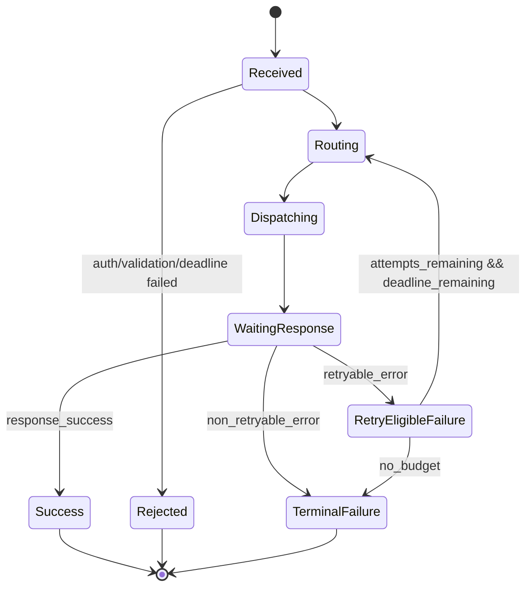
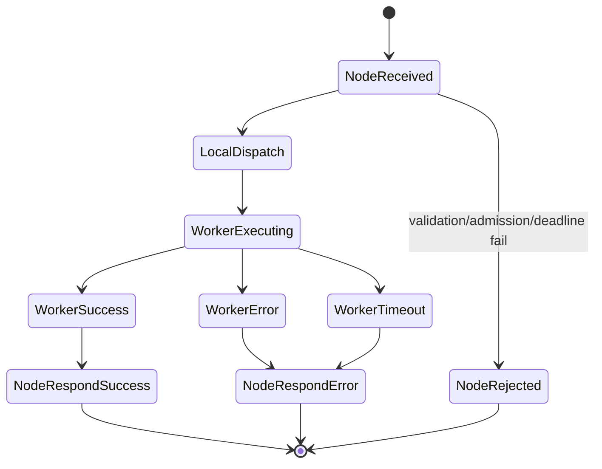
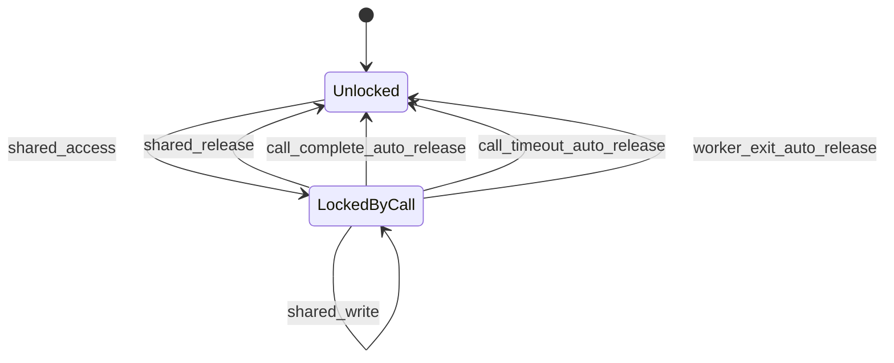
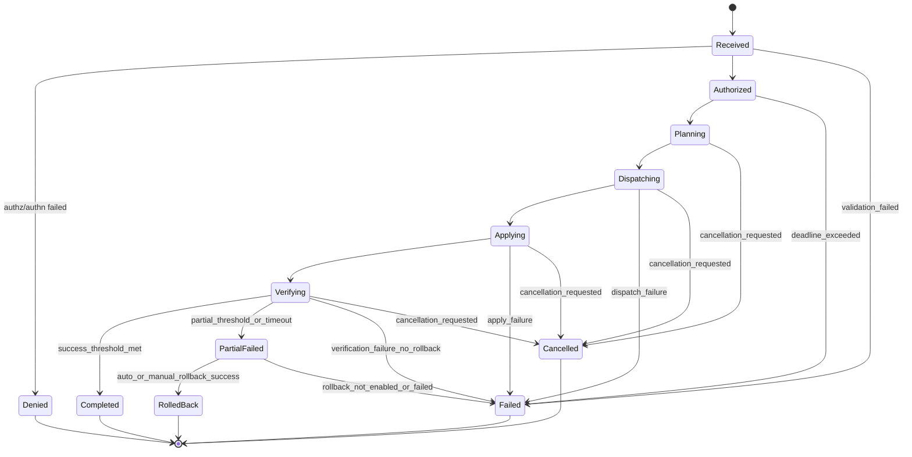
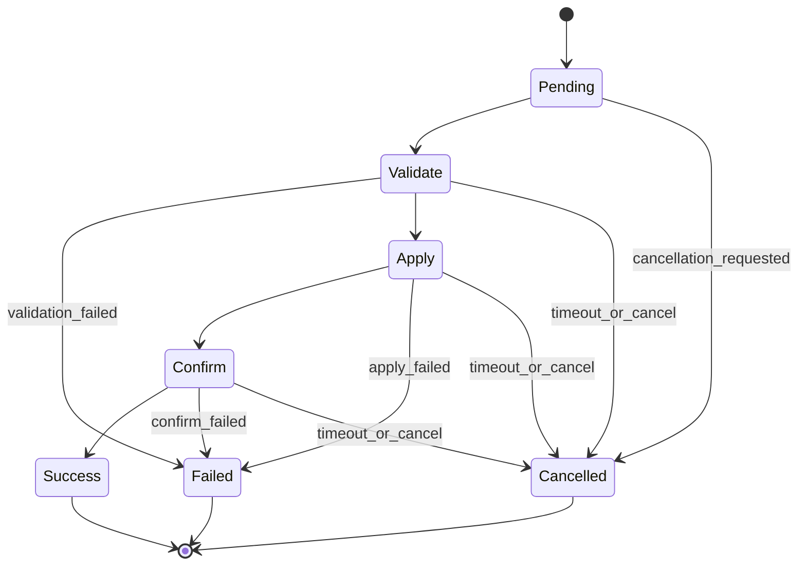

# RFC-0001: Distributed WorkerProcedureCall Cluster Protocol and Execution Semantics

- Status: Draft
- Last updated: 2026-02-28
- Audience: maintainers of WorkerProcedureCall, networking layer, and cluster gateway components
- Scope: normative specification for horizontal execution across multiple nodes while preserving WorkerProcedureCall local semantics

## 1. Abstract

This document defines a strict cluster architecture for horizontally scaling WorkerProcedureCall across many servers. It specifies:

1. System roles and responsibilities
2. Wire protocol and message schemas
3. Call lifecycle and state transitions
4. Failure semantics and retry behavior
5. Routing policies and node selection
6. Security and observability requirements

This document is the authoritative baseline for implementation decisions to avoid drift across local worker runtime, network transport, and gateway routing.

## 2. Conformance Language

The keywords `MUST`, `MUST NOT`, `REQUIRED`, `SHALL`, `SHALL NOT`, `SHOULD`, `SHOULD NOT`, `RECOMMENDED`, `MAY`, and `OPTIONAL` are to be interpreted as described in RFC 2119 and RFC 8174.

## 3. Goals and Non-Goals

### 3.1 Goals

1. Horizontally distribute remote procedure calls across many nodes.
2. Keep local per-node execution semantics compatible with WorkerProcedureCall.
3. Provide deterministic deadlines, retry semantics, and explicit unknown-outcome behavior.
4. Support secure, authenticated, and authorized execution across untrusted networks.
5. Provide strong observability and debuggability.

### 3.2 Non-Goals

1. Exactly-once execution across a distributed network (not guaranteed).
2. Cross-node shared memory semantics (SharedArrayBuffer is host-local only).
3. Automatic conversion of non-idempotent procedures into idempotent procedures.

## 4. Terminology

1. `client`: caller using SDK.
2. `gateway`: stateless ingress component that authenticates, authorizes, routes, and retries.
3. `node`: server hosting a Node Agent plus a local WorkerProcedureCall instance.
4. `worker`: local thread/process managed by WorkerProcedureCall.
5. `attempt`: one dispatch try for a logical call.
6. `logical call`: request lifecycle from initial client submit until final response.
7. `deadline`: absolute UTC epoch milliseconds after which no further work is permitted.
8. `unknown outcome`: gateway cannot determine if remote execution committed.

## 5. System Architecture

## 5.1 Roles

1. Client SDK
- builds call envelope
- applies caller retry policy and cancellation semantics

2. Gateway (stateless)
- validates authn/authz
- selects node using routing policy
- enforces retry budget and deadline

3. Node Agent
- receives cluster call envelopes
- performs local admission checks
- invokes local WorkerProcedureCall

4. Control Plane
- stores node liveness, capabilities, version hashes, and health/weight metadata

5. Local WorkerProcedureCall
- schedules work across local workers
- enforces local lifecycle guarantees (including call-scoped shared lock cleanup)

## 5.2 Control Plane Consistency Model

1. Heartbeat interval: `SHOULD` be 2s to 5s.
2. Heartbeat TTL: `MUST` be at least 2x heartbeat interval.
3. Capability records `MUST` include:
- node_id
- function_name
- function_hash_sha1
- install_state
- timestamp
4. Gateways `MUST` tolerate stale control-plane views and handle runtime dispatch failures gracefully.

## 6. Security Model

## 6.1 Transport Security

1. All gateway-node and inter-service traffic `MUST` use TLS 1.3.
2. Production deployments `MUST` use mTLS with rotating certificates.
3. Cipher suites and certificate policy `MUST` be centrally managed.

## 6.2 Authentication and Authorization

1. Gateway `MUST` authenticate caller identity before routing.
2. Gateway `MUST` perform per-function authorization checks.
3. Claims propagated to nodes `MUST` be signed and tamper-evident.
4. Nodes `SHOULD` perform defense-in-depth claim validation for critical operations.

## 6.3 Replay and Abuse Protection

1. Envelope `MUST` include `request_id`.
2. Envelope `SHOULD` include `idempotency_key` for retry-safe operations.
3. Gateways `SHOULD` enforce nonce/replay windows.
4. Admission controls `MUST` exist for per-tenant and per-function limits.

## 7. Transport and Wire Protocol

## 7.1 Protocol Versioning

1. Every message `MUST` include `protocol_version`.
2. Initial version is `1`.
3. Breaking changes `MUST` increment major protocol version.
4. Unknown optional fields `MUST` be ignored.
5. Unknown required fields `MUST` fail validation.

## 7.2 Serialization

1. Baseline encoding is UTF-8 JSON.
2. Message payloads `MUST` be JSON-serializable.
3. Binary payload mode `MAY` be added in future versions with explicit `content_type`.

## 7.3 Common Envelope Fields

All wire messages `MUST` include:

```json
{
  "protocol_version": 1,
  "message_type": "string",
  "timestamp_unix_ms": 0
}
```

## 7.4 Message Schemas

The following schemas are normative pseudo-JSON-schema.

### 7.4.1 `cluster_call_request`

```json
{
  "protocol_version": 1,
  "message_type": "cluster_call_request",
  "timestamp_unix_ms": 0,
  "request_id": "req_...",
  "trace_id": "trace_...",
  "span_id": "span_...",
  "attempt_index": 1,
  "max_attempts": 2,
  "deadline_unix_ms": 0,
  "function_name": "string",
  "function_hash_sha1": "optional_sha1_hex",
  "args": [],
  "routing_hint": {
    "mode": "auto | target_node | affinity",
    "target_node_id": "optional_string",
    "affinity_key": "optional_string",
    "zone": "optional_string"
  },
  "idempotency_key": "optional_string",
  "caller_identity": {
    "subject": "string",
    "tenant_id": "string",
    "scopes": ["..."],
    "signed_claims": "opaque_string"
  },
  "metadata": {
    "optional_key": "optional_value"
  }
}
```

Validation rules:

1. `deadline_unix_ms` `MUST` be greater than current UTC epoch time when accepted.
2. `attempt_index` `MUST` be in `[1, max_attempts]`.
3. `function_name` `MUST` be non-empty.
4. `args` `MUST` be an array.

### 7.4.2 `cluster_call_ack`

```json
{
  "protocol_version": 1,
  "message_type": "cluster_call_ack",
  "timestamp_unix_ms": 0,
  "request_id": "req_...",
  "attempt_index": 1,
  "node_id": "node_...",
  "accepted": true,
  "queue_position": 0,
  "estimated_start_delay_ms": 0
}
```

### 7.4.3 `cluster_call_response_success`

```json
{
  "protocol_version": 1,
  "message_type": "cluster_call_response_success",
  "timestamp_unix_ms": 0,
  "request_id": "req_...",
  "attempt_index": 1,
  "node_id": "node_...",
  "function_name": "string",
  "function_hash_sha1": "sha1_hex",
  "return_value": {},
  "timing": {
    "gateway_received_unix_ms": 0,
    "node_received_unix_ms": 0,
    "worker_started_unix_ms": 0,
    "worker_finished_unix_ms": 0
  }
}
```

### 7.4.4 `cluster_call_response_error`

```json
{
  "protocol_version": 1,
  "message_type": "cluster_call_response_error",
  "timestamp_unix_ms": 0,
  "request_id": "req_...",
  "attempt_index": 1,
  "node_id": "optional_node",
  "error": {
    "code": "AUTH_FAILED | FORBIDDEN_FUNCTION | NO_CAPABLE_NODE | NODE_OVERLOADED_RETRYABLE | DISPATCH_FAILED_RETRYABLE | UNKNOWN_OUTCOME_RETRYABLE_WITH_IDEMPOTENCY | REMOTE_FUNCTION_ERROR | DEADLINE_EXCEEDED | CANCELLED | INTERNAL_SUPERVISOR_ERROR",
    "message": "string",
    "retryable": true,
    "unknown_outcome": false,
    "details": {}
  },
  "timing": {
    "gateway_received_unix_ms": 0,
    "last_attempt_started_unix_ms": 0
  }
}
```

### 7.4.5 `cluster_call_cancel`

```json
{
  "protocol_version": 1,
  "message_type": "cluster_call_cancel",
  "timestamp_unix_ms": 0,
  "request_id": "req_...",
  "reason": "client_cancelled | deadline_exceeded | gateway_shutdown"
}
```

### 7.4.6 `cluster_call_cancel_ack`

```json
{
  "protocol_version": 1,
  "message_type": "cluster_call_cancel_ack",
  "timestamp_unix_ms": 0,
  "request_id": "req_...",
  "cancelled": true,
  "best_effort_only": true
}
```

### 7.4.7 `node_heartbeat`

```json
{
  "protocol_version": 1,
  "message_type": "node_heartbeat",
  "timestamp_unix_ms": 0,
  "node_id": "node_...",
  "health_state": "ready | degraded | restarting | stopped",
  "metrics": {
    "inflight_calls": 0,
    "pending_calls": 0,
    "success_rate_1m": 0.0,
    "timeout_rate_1m": 0.0,
    "ewma_latency_ms": 0.0
  }
}
```

### 7.4.8 `node_capability_announce`

```json
{
  "protocol_version": 1,
  "message_type": "node_capability_announce",
  "timestamp_unix_ms": 0,
  "node_id": "node_...",
  "capabilities": [
    {
      "function_name": "string",
      "function_hash_sha1": "sha1_hex",
      "installed": true
    }
  ]
}
```

## 8. Call Lifecycle (Normative)

## 8.1 Gateway Processing

1. Validate envelope schema.
2. Authenticate caller.
3. Authorize function.
4. Reject immediately if deadline expired.
5. Resolve candidate nodes by capability and policy filters.
6. Select node using routing policy (Section 10).
7. Dispatch attempt.
8. If terminal success or terminal failure, return immediately.
9. If retryable failure and budget remains, retry.
10. If budget exhausted, return last mapped error.

## 8.2 Node Processing

1. Validate request envelope and deadline.
2. Validate local function availability and optional hash pin.
3. Apply admission controls.
4. Execute local WorkerProcedureCall call.
5. Return success or mapped error.
6. Ensure local call-scoped cleanup semantics are preserved.

## 8.3 Timeout Handling

1. Gateway `MUST` enforce absolute logical-call deadline.
2. Node `SHOULD` enforce per-attempt soft timeout bounded by remaining deadline.
3. Timeouts after remote dispatch may be `unknown_outcome=true`.

## 9. Failure Semantics

## 9.1 Retryability Rules

1. `REMOTE_FUNCTION_ERROR` is terminal by default.
2. `NODE_OVERLOADED_RETRYABLE` is retryable.
3. `DISPATCH_FAILED_RETRYABLE` is retryable.
4. `UNKNOWN_OUTCOME_RETRYABLE_WITH_IDEMPOTENCY` is retryable only with idempotency key.
5. `DEADLINE_EXCEEDED` is terminal.
6. `AUTH_FAILED` and `FORBIDDEN_FUNCTION` are terminal.

## 9.2 Unknown Outcome Contract

If a dispatch outcome is unknown (network break after possible remote start), gateway `MUST` return:

1. `error.code = UNKNOWN_OUTCOME_RETRYABLE_WITH_IDEMPOTENCY`
2. `error.unknown_outcome = true`

Client behavior:

1. If idempotency key exists, client `SHOULD` retry until deadline.
2. If idempotency key is absent, client `SHOULD NOT` auto-retry non-idempotent operations.

## 10. Routing and Load Balancing

## 10.1 Candidate Filtering

Gateway `MUST` filter by:

1. node health (`ready` only by default; `degraded` optional with penalty)
2. required function presence
3. required hash pin (if provided)
4. tenant/zone/policy constraints

## 10.2 Routing Modes

1. `target_node`: direct route to explicit node id, fail if unavailable.
2. `affinity`: weighted rendezvous hashing on `affinity_key`.
3. `auto`: power-of-two-choices with weighted score.

## 10.3 Auto Scoring Formula

Gateway `SHOULD` use:

```text
score = a * normalized_inflight + b * ewma_latency_ms + c * error_penalty
```

Recommended defaults:

1. `a = 0.5`
2. `b = 0.4`
3. `c = 0.1`

Lower score is better.

## 10.4 Outlier Ejection

1. Nodes exceeding timeout/error thresholds over rolling windows `SHOULD` be ejected temporarily.
2. Ejected nodes `MUST` be periodically probed for recovery.
3. Ejection and re-admission events `MUST` be logged.

## 11. Retry Matrix

| Error code | Retryable | Unknown outcome | Idempotency key required for retry | Gateway default action | Client guidance |
|---|---:|---:|---:|---|---|
| `AUTH_FAILED` | No | No | No | Return terminal error | Fix credentials |
| `FORBIDDEN_FUNCTION` | No | No | No | Return terminal error | Fix policy/scopes |
| `NO_CAPABLE_NODE` | Yes | No | No | Retry until short budget exhausted | Retry with backoff |
| `NODE_OVERLOADED_RETRYABLE` | Yes | No | No | Retry with jitter | Backoff and retry |
| `DISPATCH_FAILED_RETRYABLE` | Yes | Possible | Prefer Yes | Retry if budget remains | Use idempotency key |
| `UNKNOWN_OUTCOME_RETRYABLE_WITH_IDEMPOTENCY` | Conditional | Yes | Yes | Retry only if key present | Manual reconciliation if no key |
| `REMOTE_FUNCTION_ERROR` | No (default) | No | No | Return terminal error | Fix application logic |
| `DEADLINE_EXCEEDED` | No | Possible | No | Return terminal error | Increase deadline or reduce load |
| `CANCELLED` | No | No | No | Return terminal error | Caller-driven |
| `INTERNAL_SUPERVISOR_ERROR` | Yes | Possible | Prefer Yes | Retry with bounded attempts | Use idempotency key |

## 12. State Machines

## 12.1 Gateway Logical Call State Machine



## 12.2 Node Attempt State Machine



## 12.3 Call-Scoped Shared Lock Lifecycle (Local Node)



## 13. Observability Requirements

## 13.1 Required Metrics

1. `gateway_calls_total` by outcome code
2. `gateway_call_latency_ms` histogram
3. `gateway_attempts_per_call` histogram
4. `node_inflight_calls`
5. `node_pending_calls`
6. `node_ewma_latency_ms`
7. `node_timeout_rate`

## 13.2 Required Events

1. Call lifecycle:
- accepted
- routed
- dispatched
- attempt_failed
- retried
- completed
- failed

2. Node lifecycle:
- heartbeat_missing
- outlier_ejected
- outlier_recovered
- capability_changed

3. Shared lock lifecycle:
- call_complete_auto_release
- call_timeout_auto_release
- worker_exit_auto_release

Each event `MUST` include:

1. `request_id` (if call-scoped)
2. `trace_id` (if available)
3. `node_id` (if available)
4. `timestamp_unix_ms`

## 14. Remote Administrative Mutation Plane

## 14.1 Plane Separation

The protocol defines two orthogonal planes:

1. Data plane: remote function call execution (`cluster_call_*` messages).
2. Control/mutation plane: hot definition/redefinition/undefinition and administrative mutations (`cluster_admin_mutation_*` messages).

Requirements:

1. Mutation-plane authorization `MUST` be enforced independently from data-plane call authorization.
2. A principal with `rpc.call:*` permissions `MUST NOT` be implicitly granted mutation privileges.
3. Mutation-plane operations `MUST` be fully auditable (Section 14.7).

## 14.2 Mutation Types and Scope

### 14.2.1 Required mutation types

`mutation_type` `MUST` support at minimum:

1. `define_function`
2. `redefine_function`
3. `undefine_function`
4. `define_dependency`
5. `undefine_dependency`
6. `define_constant`
7. `undefine_constant`
8. `define_database_connection`
9. `undefine_database_connection`

### 14.2.2 Shared-memory admin mutation types

Where shared-memory administrative operations are enabled, `mutation_type` `MAY` additionally include:

1. `shared_create_chunk`
2. `shared_free_chunk`
3. `shared_reconfigure_limits`
4. `shared_clear_all_chunks` (break-glass only; production guarded)

### 14.2.3 Target scope

`target_scope` values:

1. `single_node`
2. `node_selector`
3. `cluster_wide`

## 14.3 Wire Message Schemas (Normative)

### 14.3.1 `cluster_admin_mutation_request`

```json
{
  "protocol_version": 1,
  "message_type": "cluster_admin_mutation_request",
  "timestamp_unix_ms": 0,
  "mutation_id": "mut_...",
  "request_id": "req_...",
  "trace_id": "trace_...",
  "deadline_unix_ms": 0,
  "target_scope": "single_node | node_selector | cluster_wide",
  "target_selector": {
    "node_ids": ["optional_node_id"],
    "labels": { "role": "worker", "region": "us-east-1" },
    "zones": ["optional_zone"],
    "version_constraints": {
      "node_agent_semver": ">=1.0.0",
      "runtime_semver": ">=1.0.0"
    }
  },
  "mutation_type": "define_function | redefine_function | undefine_function | define_dependency | undefine_dependency | define_constant | undefine_constant | define_database_connection | undefine_database_connection | shared_create_chunk | shared_free_chunk | shared_reconfigure_limits | shared_clear_all_chunks",
  "payload": {},
  "expected_version": {
    "entity_name": "optional_name",
    "entity_version": "optional_etag_or_hash",
    "compare_mode": "exact | at_least"
  },
  "dry_run": false,
  "rollout_strategy": {
    "mode": "all_at_once | rolling_percent | canary_then_expand | single_node",
    "min_success_percent": 100,
    "batch_percent": 10,
    "canary_node_count": 1,
    "inter_batch_delay_ms": 1000,
    "apply_timeout_ms": 30000,
    "verify_timeout_ms": 30000,
    "rollback_policy": {
      "auto_rollback": true,
      "rollback_on_partial_failure": true,
      "rollback_on_verification_failure": true
    }
  },
  "in_flight_policy": "no_interruption | drain_and_swap",
  "change_context": {
    "reason": "required string",
    "change_ticket_id": "required string in production",
    "requested_by": "actor identifier",
    "dual_authorization": {
      "required": false,
      "approver_subject": "optional second approver"
    }
  },
  "artifact": {
    "source_hash_sha256": "optional hash",
    "signature": "optional detached signature",
    "signature_key_id": "optional key id"
  },
  "auth_context": {
    "subject": "string",
    "tenant_id": "string",
    "environment": "dev | staging | prod",
    "capability_claims": [
      "rpc.admin.mutate:function:redefine",
      "rpc.read.cluster:*"
    ],
    "signed_claims": "opaque string"
  },
  "idempotency_key": "optional string"
}
```

Validation rules:

1. `mutation_id`, `request_id`, `trace_id`, and `deadline_unix_ms` are `REQUIRED`.
2. `mutation_id` `MUST` be globally unique within the dedupe window.
3. `target_scope=single_node` `MUST` specify exactly one node id.
4. `target_scope=node_selector` `MUST` provide at least one selector predicate.
5. `target_scope=cluster_wide` `MUST NOT` provide explicit node ids.
6. `dry_run=true` `MUST NOT` mutate state.
7. `redefine_function` in production `MUST` include signed artifact metadata unless explicitly disabled by policy.
8. Production mutations `MUST` include `change_context.reason` and `change_context.change_ticket_id`.

### 14.3.2 `cluster_admin_mutation_ack`

```json
{
  "protocol_version": 1,
  "message_type": "cluster_admin_mutation_ack",
  "timestamp_unix_ms": 0,
  "mutation_id": "mut_...",
  "request_id": "req_...",
  "accepted": true,
  "planner_id": "gateway_or_controller_id",
  "target_node_count": 0,
  "dry_run": false
}
```

### 14.3.3 `cluster_admin_mutation_result`

```json
{
  "protocol_version": 1,
  "message_type": "cluster_admin_mutation_result",
  "timestamp_unix_ms": 0,
  "mutation_id": "mut_...",
  "request_id": "req_...",
  "status": "completed | partially_failed | rolled_back | dry_run_completed",
  "rollout_strategy": "all_at_once | rolling_percent | canary_then_expand | single_node",
  "summary": {
    "target_node_count": 0,
    "applied_node_count": 0,
    "failed_node_count": 0,
    "rolled_back_node_count": 0,
    "min_success_percent": 100,
    "achieved_success_percent": 100
  },
  "per_node_results": [
    {
      "node_id": "node_...",
      "status": "applied | failed | rolled_back | skipped",
      "error_code": "optional error code",
      "error_message": "optional error message",
      "applied_version": "optional hash/version"
    }
  ],
  "timing": {
    "planning_started_unix_ms": 0,
    "apply_started_unix_ms": 0,
    "verify_finished_unix_ms": 0
  },
  "audit_record_id": "immutable_audit_id"
}
```

### 14.3.4 `cluster_admin_mutation_error`

```json
{
  "protocol_version": 1,
  "message_type": "cluster_admin_mutation_error",
  "timestamp_unix_ms": 0,
  "mutation_id": "mut_...",
  "request_id": "req_...",
  "error": {
    "code": "ADMIN_AUTH_FAILED | ADMIN_FORBIDDEN | ADMIN_VALIDATION_FAILED | ADMIN_TARGET_EMPTY | ADMIN_CONFLICT | ADMIN_DISPATCH_RETRYABLE | ADMIN_TIMEOUT | ADMIN_PARTIAL_FAILURE | ADMIN_ROLLBACK_FAILED | ADMIN_INTERNAL",
    "message": "string",
    "retryable": false,
    "unknown_outcome": false,
    "details": {}
  }
}
```

## 14.4 Rollout and Consistency Semantics

### 14.4.1 Rollout strategies

1. `all_at_once`: dispatch to all selected nodes concurrently.
2. `rolling_percent`: mutate in batches (`batch_percent`) with verification gates between batches.
3. `canary_then_expand`: mutate canary subset first, verify, then expand in one or more waves.
4. `single_node`: mutate one node only; intended for targeted testing or break-glass.

### 14.4.2 Success criteria and timeout behavior

1. Mutations `MUST` evaluate `min_success_percent` against final eligible target set.
2. Apply timeout and verify timeout are independently enforced.
3. If timeout occurs before threshold is met, status `MUST` be `partially_failed` or `failed` based on achieved success.
4. `dry_run` `MUST` return resolved targets and policy decisions without applying changes.

### 14.4.3 Partial failure and rollback

1. Rollback policy `MAY` be automatic or manual.
2. If auto-rollback is enabled and rollback trigger condition is met, rollback `MUST` be attempted on successfully mutated nodes.
3. Rollback attempts and outcomes `MUST` be immutably audited.
4. If rollback fails on any node, final status `MUST` be `rolled_back` with failure details or `ADMIN_ROLLBACK_FAILED`.

### 14.4.4 In-flight call handling

1. `no_interruption`: in-flight calls continue on old definition; new calls use updated definition once node apply is complete.
2. `drain_and_swap`: node drains eligible in-flight calls before swapping definitions.
3. If `function_hash_sha1` is pinned on call envelopes, nodes `MUST` honor pinning or reject with explicit version mismatch.

## 14.5 Granular Privilege Model (RBAC + ABAC)

### 14.5.1 Capability namespaces

Required namespace examples:

1. `rpc.call:*`
2. `rpc.call:function:<name>`
3. `rpc.admin.mutate:*`
4. `rpc.admin.mutate:function:define`
5. `rpc.admin.mutate:function:redefine`
6. `rpc.admin.mutate:function:undefine`
7. `rpc.admin.mutate:dependency:define`
8. `rpc.admin.mutate:dependency:undefine`
9. `rpc.admin.mutate:constant:define`
10. `rpc.admin.mutate:constant:undefine`
11. `rpc.admin.mutate:database_connection:define`
12. `rpc.admin.mutate:database_connection:undefine`
13. `rpc.admin.mutate:shared:*` (optional deployment feature)
14. `rpc.read.cluster:*`
15. `rpc.read.debug:*`

### 14.5.2 ABAC scope dimensions

Policy evaluation `MUST` support constraints on:

1. tenant
2. environment
3. cluster id
4. node selector (labels, zone, explicit node id)
5. function name exact match and pattern match
6. mutation type

### 14.5.3 Evaluation precedence

1. `deny` rules `MUST` override `allow` rules.
2. Unmatched requests `MUST` default deny.
3. Least-privilege policy is the default posture.
4. Call execution permissions and mutation permissions `MUST` be evaluated independently.

### 14.5.4 Concrete policy examples

#### Example A: Full administrator

```json
{
  "policy_id": "full_admin_prod",
  "effect": "allow",
  "subject_match": { "group": "cluster-admins" },
  "capabilities": ["rpc.call:*", "rpc.admin.mutate:*", "rpc.read.cluster:*", "rpc.read.debug:*"],
  "constraints": {
    "tenant": "*",
    "environment": ["staging", "prod"],
    "cluster": "*"
  }
}
```

#### Example B: Function-limited mutation admin

```json
{
  "policy_id": "billing_function_admin",
  "effect": "allow",
  "subject_match": { "service_account": "svc_billing_release" },
  "capabilities": [
    "rpc.call:function:BillingCharge",
    "rpc.admin.mutate:function:define",
    "rpc.admin.mutate:function:redefine",
    "rpc.admin.mutate:function:undefine",
    "rpc.read.cluster:*"
  ],
  "constraints": {
    "tenant": "billing",
    "environment": ["staging"],
    "function_name_pattern": "^Billing.*$",
    "target_selector_labels": { "service": "billing" }
  }
}
```

#### Example C: Call-only client

```json
{
  "policy_id": "call_only_client",
  "effect": "allow",
  "subject_match": { "client_id": "client_portal_backend" },
  "capabilities": ["rpc.call:function:GetUserProfile"],
  "constraints": {
    "tenant": "customer_portal",
    "environment": ["prod"]
  }
}
```

## 14.6 Security Hardening Requirements

1. Administrative mutation requests `MUST` require mTLS and signed identity tokens.
2. Credentials used for mutation operations `MUST` be short-lived.
3. Replay protection `MUST` include nonce or dedupe protections keyed by `mutation_id`.
4. Mutation requests in production `MUST` include change reason and ticket metadata.
5. Production deployments `SHOULD` support optional dual-authorization (two-person approval).
6. Function redefinitions in production `MUST` support signed artifact/hash verification unless policy explicitly disables this for specific environments.
7. Authorization enforcement `MUST` occur server-side; client-side checks are advisory only.

## 14.7 Auditability and Observability

### 14.7.1 Immutable audit record requirements

Each mutation `MUST` emit immutable audit records containing:

1. actor identity
2. evaluated privileges and decision path
3. payload hash
4. target scope and resolved node set
5. per-node result
6. timestamps for authorize/plan/apply/verify
7. rollback trigger and rollback result

### 14.7.2 Event taxonomy

Required event names:

1. `admin_mutation_requested`
2. `admin_mutation_authorized`
3. `admin_mutation_applied`
4. `admin_mutation_partially_failed`
5. `admin_mutation_rolled_back`
6. `admin_mutation_denied`

### 14.7.3 Required metrics

1. `admin_mutation_requests_total`
2. `admin_mutation_success_total`
3. `admin_mutation_failure_total`
4. `admin_mutation_rollout_duration_ms` histogram
5. `admin_mutation_rollback_total`
6. `admin_mutation_authz_denied_total` (labeled by deny reason)

## 14.8 Mutation Failure Semantics and Retry Matrix

### 14.8.1 Idempotency and dedupe

1. `mutation_id` is `REQUIRED` for all mutation requests.
2. Gateway/controller `MUST` dedupe repeated submissions by `mutation_id` within a configured retention window.
3. Exactly-once mutation application is not guaranteed in distributed failure scenarios.
4. Implementations `MUST` provide at-least-once-safe behavior through dedupe and CAS (`expected_version`) checks.

### 14.8.2 Mutation retry matrix

| Error code | Retryable | Unknown outcome | Gateway/controller default action | Caller guidance |
|---|---:|---:|---|---|
| `ADMIN_AUTH_FAILED` | No | No | Reject terminal | Fix auth |
| `ADMIN_FORBIDDEN` | No | No | Reject terminal | Fix role/policy |
| `ADMIN_VALIDATION_FAILED` | No | No | Reject terminal | Fix payload/schema |
| `ADMIN_TARGET_EMPTY` | No | No | Reject terminal | Fix selector |
| `ADMIN_CONFLICT` | Conditional | No | Retry only with updated CAS/version | Refresh version and retry |
| `ADMIN_DISPATCH_RETRYABLE` | Yes | Possible | Retry bounded by deadline | Safe with same `mutation_id` |
| `ADMIN_TIMEOUT` | Conditional | Yes | Retry status query; optional retry apply with same id | Check audit trail first |
| `ADMIN_PARTIAL_FAILURE` | Conditional | No | Execute rollback policy or return partial | Decide manual rollback/retry |
| `ADMIN_ROLLBACK_FAILED` | No | Possible | Raise critical alert | Manual remediation |
| `ADMIN_INTERNAL` | Yes | Possible | Retry bounded | Investigate if repeated |

## 14.9 Mutation State Machines

### 14.9.1 Administrative mutation lifecycle



### 14.9.2 Per-node mutation apply lifecycle



## 14.10 Rollout Examples (Normative Scenarios)

### 14.10.1 Canary success then expand

1. Submit `redefine_function` with `rollout_strategy.mode=canary_then_expand`.
2. `canary_node_count=2`, `min_success_percent=100` for canary stage.
3. Verification passes on canary nodes.
4. Controller expands using `rolling_percent` batches.
5. Final result `completed`, no rollback required.

### 14.10.2 Canary failure with rollback

1. Submit `redefine_function` with `auto_rollback=true`.
2. Canary stage fails verification on one canary node.
3. Controller halts expansion and triggers rollback on all mutated nodes.
4. Final result `rolled_back`.
5. Audit trail contains rollback trigger and per-node rollback status.

## 14.11 End-to-End Mutation Example

### 14.11.1 Request

```json
{
  "protocol_version": 1,
  "message_type": "cluster_admin_mutation_request",
  "timestamp_unix_ms": 1761700000000,
  "mutation_id": "mut_20260228_0001",
  "request_id": "req_admin_0001",
  "trace_id": "trace_admin_abc",
  "deadline_unix_ms": 1761700030000,
  "target_scope": "node_selector",
  "target_selector": {
    "labels": { "service": "payments", "environment": "staging" }
  },
  "mutation_type": "redefine_function",
  "payload": {
    "name": "ChargeCard",
    "worker_func_source": "async function ChargeCard(...) { /* redacted */ }"
  },
  "expected_version": {
    "entity_name": "ChargeCard",
    "entity_version": "sha1_prev_version",
    "compare_mode": "exact"
  },
  "dry_run": false,
  "rollout_strategy": {
    "mode": "canary_then_expand",
    "canary_node_count": 1,
    "min_success_percent": 100,
    "apply_timeout_ms": 30000,
    "verify_timeout_ms": 30000,
    "rollback_policy": {
      "auto_rollback": true,
      "rollback_on_partial_failure": true,
      "rollback_on_verification_failure": true
    }
  },
  "in_flight_policy": "drain_and_swap",
  "change_context": {
    "reason": "Fix AVS mismatch handling",
    "change_ticket_id": "CHG-48219",
    "requested_by": "alice@example.com"
  },
  "artifact": {
    "source_hash_sha256": "sha256_...",
    "signature": "sig_...",
    "signature_key_id": "key_prod_2026_01"
  },
  "auth_context": {
    "subject": "alice@example.com",
    "tenant_id": "payments",
    "environment": "staging",
    "capability_claims": ["rpc.admin.mutate:function:redefine", "rpc.read.cluster:*"],
    "signed_claims": "jwt_or_detached_claim_blob"
  }
}
```

### 14.11.2 Result

```json
{
  "protocol_version": 1,
  "message_type": "cluster_admin_mutation_result",
  "timestamp_unix_ms": 1761700012000,
  "mutation_id": "mut_20260228_0001",
  "request_id": "req_admin_0001",
  "status": "completed",
  "rollout_strategy": "canary_then_expand",
  "summary": {
    "target_node_count": 10,
    "applied_node_count": 10,
    "failed_node_count": 0,
    "rolled_back_node_count": 0,
    "min_success_percent": 100,
    "achieved_success_percent": 100
  },
  "per_node_results": [
    { "node_id": "node_a", "status": "applied", "applied_version": "sha1_new_version" },
    { "node_id": "node_b", "status": "applied", "applied_version": "sha1_new_version" }
  ],
  "audit_record_id": "audit_mut_20260228_0001"
}
```

## 14.12 Backward Compatibility for Mutation Plane

1. This section is additive and does not change existing call execution APIs.
2. Mutation plane messages are optional for clients that only use call execution.
3. Gateways and node agents `SHOULD` advertise mutation-plane support in capability metadata.
4. Mutation-plane breaking changes require protocol major version increment.

## 14.13 Change Management and Governance

### 14.13.1 Staged rollout recommendation

1. Dev: permissive policy, dry-run required for first application.
2. Staging: canary-then-expand with automatic rollback.
3. Production: dual-authorization for high-risk mutations, mandatory change ticket, strict signed artifacts.

### 14.13.2 Production safety checklist

1. Validate auth policy for actor and target scope.
2. Confirm `expected_version` CAS token.
3. Confirm rollback policy and rollback feasibility.
4. Confirm observability sinks and audit sink are healthy.
5. Confirm deadline and timeout budgets are realistic.
6. Run optional dry-run before apply.

### 14.13.3 Break-glass procedure

1. Break-glass access `MUST` be strongly scoped and time-limited.
2. Break-glass mutations `MUST` emit high-severity audit events.
3. Break-glass use `MUST` require post-incident review and credential rotation.

## 15. Backward Compatibility and Evolution

1. New optional fields are backward compatible.
2. Required field additions require protocol version bump.
3. Gateway and node versions `SHOULD` be rolled with overlap windows.
4. Function hash pinning `SHOULD` be used during phased rollouts.

## 16. Reference Defaults (v1)

1. `max_attempts = 2`
2. Gateway retry backoff: full jitter in `[10ms, 250ms]`
3. Outlier ejection window: 30s rolling
4. Outlier threshold: timeout rate > 20% and sample size >= 50
5. Heartbeat interval: 3s
6. Heartbeat TTL: 9s

## 17. Open Implementation Decisions

1. Whether gateway retries are always internal, or optionally delegated to client SDK.
2. Whether progress streaming is needed in protocol v1 (`cluster_call_progress` message type).
3. Whether binary payload transport is included in v1 or deferred to v2.

## 18. Implementation Checklist

1. Define protocol validation for all message types.
2. Implement gateway retry engine with deadline-aware budget.
3. Implement node admission controls and error mapping.
4. Implement routing policy modes (`target_node`, `affinity`, `auto`).
5. Integrate observability event emission and metric tags.
6. Add conformance tests for retry matrix and state transitions.

## 19. Appendix A: Canonical Error Object

```json
{
  "code": "STRING_ENUM",
  "message": "Human readable reason",
  "retryable": false,
  "unknown_outcome": false,
  "details": {
    "attempt_index": 1,
    "max_attempts": 2,
    "node_id": "optional",
    "function_name": "optional"
  }
}
```

## 20. Appendix B: Canonical Result Object

```json
{
  "request_id": "req_...",
  "trace_id": "trace_...",
  "attempt_count": 1,
  "node_id": "node_...",
  "function_name": "example",
  "function_hash_sha1": "sha1_hex",
  "return_value": {}
}
```

## 21. Operations Readiness (Phase 13)

## 21.1 Required Operability Artifacts

Implementations MUST maintain and publish:

1. observability mapping for call, mutation, routing, and transport layers,
2. alert definitions with threshold and ownership metadata,
3. incident runbooks for triage, rollback, break-glass, and key/cert rotation,
4. staged deployment readiness checklist with promotion gates,
5. repeatable chaos/stress validation scenarios and pass/fail criteria.

## 21.2 Required Correlation Fields

Operational telemetry MUST include correlation keys where available:

1. `trace_id`
2. `request_id`
3. `mutation_id`
4. `node_id`
5. `timestamp_unix_ms`

## 21.3 Required Alert Classes

At minimum, operators MUST define alerts for:

1. mutation failure spikes,
2. authorization-denial anomalies,
3. timeout/retry storms,
4. rollback frequency anomalies,
5. node health degradation and unhealthy-node routing growth.

## 21.4 Chaos/Stress Validation Matrix

The release process MUST validate all scenarios below:

1. node crash during active load,
2. network partition simulation,
3. transport reconnect storms,
4. mutation rollout during degraded cluster.

Pass criteria:

1. deterministic terminal outcomes,
2. bounded retry/timeout behavior,
3. observable lifecycle and transport telemetry,
4. no lingering session/request/resource leaks.

## 21.5 Operational Documentation References

The implementation-maintained references are:

1. `design_documentation/Operations_Runbook_Phase13.md`
2. `design_documentation/Operations_Readiness_Checklist_Phase13.md`
