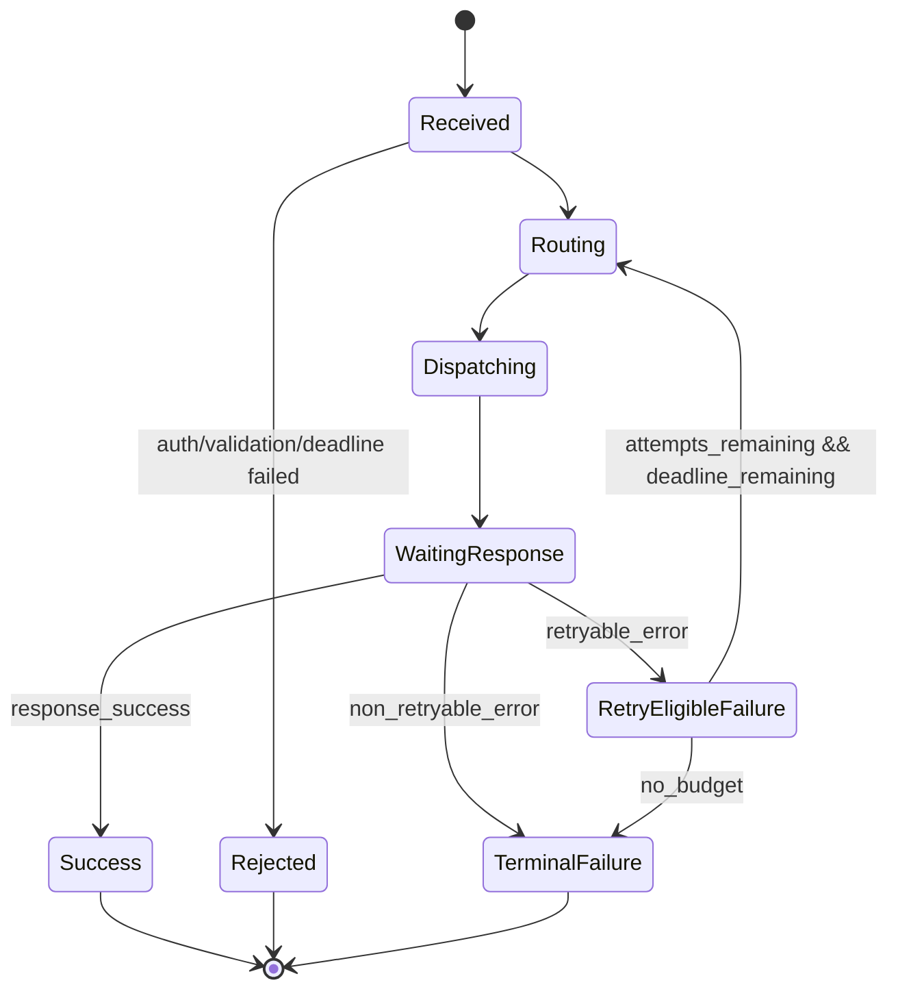
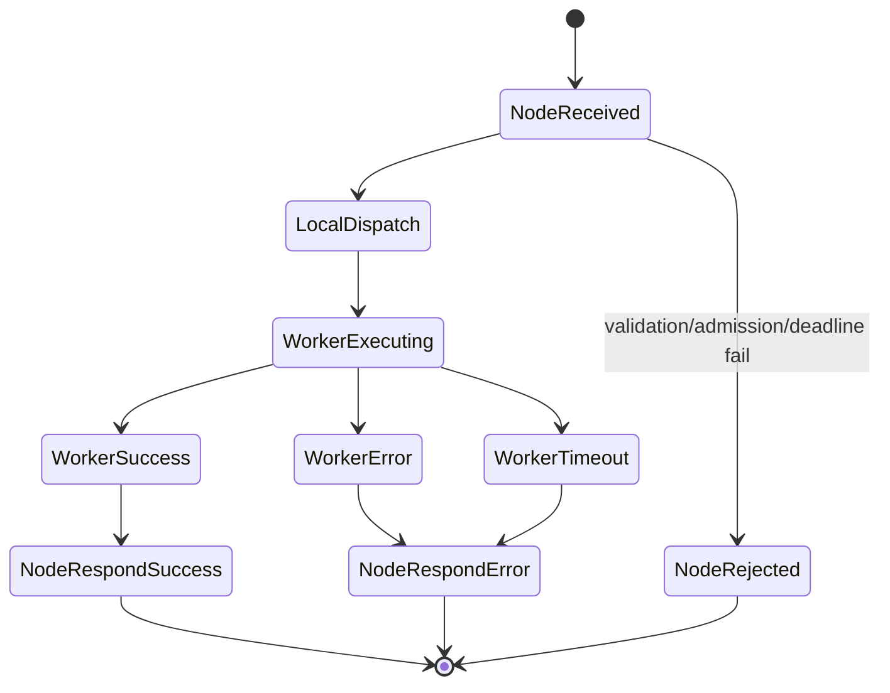
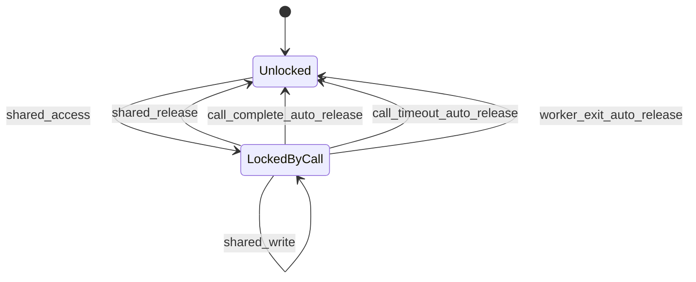

# RFC-0001: Distributed WorkerProcedureCall Cluster Protocol and Execution Semantics

- Status: Draft
- Last updated: 2026-02-28
- Audience: maintainers of WorkerProcedureCall, networking layer, and cluster gateway components
- Scope: normative specification for horizontal execution across multiple nodes while preserving WorkerProcedureCall local semantics

## 1. Abstract

This document defines a strict cluster architecture for horizontally scaling WorkerProcedureCall across many servers. It specifies:

1. System roles and responsibilities
2. Wire protocol and message schemas
3. Call lifecycle and state transitions
4. Failure semantics and retry behavior
5. Routing policies and node selection
6. Security and observability requirements

This document is the authoritative baseline for implementation decisions to avoid drift across local worker runtime, network transport, and gateway routing.

## 2. Conformance Language

The keywords `MUST`, `MUST NOT`, `REQUIRED`, `SHALL`, `SHALL NOT`, `SHOULD`, `SHOULD NOT`, `RECOMMENDED`, `MAY`, and `OPTIONAL` are to be interpreted as described in RFC 2119 and RFC 8174.

## 3. Goals and Non-Goals

### 3.1 Goals

1. Horizontally distribute remote procedure calls across many nodes.
2. Keep local per-node execution semantics compatible with WorkerProcedureCall.
3. Provide deterministic deadlines, retry semantics, and explicit unknown-outcome behavior.
4. Support secure, authenticated, and authorized execution across untrusted networks.
5. Provide strong observability and debuggability.

### 3.2 Non-Goals

1. Exactly-once execution across a distributed network (not guaranteed).
2. Cross-node shared memory semantics (SharedArrayBuffer is host-local only).
3. Automatic conversion of non-idempotent procedures into idempotent procedures.

## 4. Terminology

1. `client`: caller using SDK.
2. `gateway`: stateless ingress component that authenticates, authorizes, routes, and retries.
3. `node`: server hosting a Node Agent plus a local WorkerProcedureCall instance.
4. `worker`: local thread/process managed by WorkerProcedureCall.
5. `attempt`: one dispatch try for a logical call.
6. `logical call`: request lifecycle from initial client submit until final response.
7. `deadline`: absolute UTC epoch milliseconds after which no further work is permitted.
8. `unknown outcome`: gateway cannot determine if remote execution committed.

## 5. System Architecture

## 5.1 Roles

1. Client SDK
- builds call envelope
- applies caller retry policy and cancellation semantics

2. Gateway (stateless)
- validates authn/authz
- selects node using routing policy
- enforces retry budget and deadline

3. Node Agent
- receives cluster call envelopes
- performs local admission checks
- invokes local WorkerProcedureCall

4. Control Plane
- stores node liveness, capabilities, version hashes, and health/weight metadata

5. Local WorkerProcedureCall
- schedules work across local workers
- enforces local lifecycle guarantees (including call-scoped shared lock cleanup)

## 5.2 Control Plane Consistency Model

1. Heartbeat interval: `SHOULD` be 2s to 5s.
2. Heartbeat TTL: `MUST` be at least 2x heartbeat interval.
3. Capability records `MUST` include:
- node_id
- function_name
- function_hash_sha1
- install_state
- timestamp
4. Gateways `MUST` tolerate stale control-plane views and handle runtime dispatch failures gracefully.

## 6. Security Model

## 6.1 Transport Security

1. All gateway-node and inter-service traffic `MUST` use TLS 1.3.
2. Production deployments `MUST` use mTLS with rotating certificates.
3. Cipher suites and certificate policy `MUST` be centrally managed.

## 6.2 Authentication and Authorization

1. Gateway `MUST` authenticate caller identity before routing.
2. Gateway `MUST` perform per-function authorization checks.
3. Claims propagated to nodes `MUST` be signed and tamper-evident.
4. Nodes `SHOULD` perform defense-in-depth claim validation for critical operations.

## 6.3 Replay and Abuse Protection

1. Envelope `MUST` include `request_id`.
2. Envelope `SHOULD` include `idempotency_key` for retry-safe operations.
3. Gateways `SHOULD` enforce nonce/replay windows.
4. Admission controls `MUST` exist for per-tenant and per-function limits.

## 7. Transport and Wire Protocol

## 7.1 Protocol Versioning

1. Every message `MUST` include `protocol_version`.
2. Initial version is `1`.
3. Breaking changes `MUST` increment major protocol version.
4. Unknown optional fields `MUST` be ignored.
5. Unknown required fields `MUST` fail validation.

## 7.2 Serialization

1. Baseline encoding is UTF-8 JSON.
2. Message payloads `MUST` be JSON-serializable.
3. Binary payload mode `MAY` be added in future versions with explicit `content_type`.

## 7.3 Common Envelope Fields

All wire messages `MUST` include:

```json
{
  "protocol_version": 1,
  "message_type": "string",
  "timestamp_unix_ms": 0
}
```

## 7.4 Message Schemas

The following schemas are normative pseudo-JSON-schema.

### 7.4.1 `cluster_call_request`

```json
{
  "protocol_version": 1,
  "message_type": "cluster_call_request",
  "timestamp_unix_ms": 0,
  "request_id": "req_...",
  "trace_id": "trace_...",
  "span_id": "span_...",
  "attempt_index": 1,
  "max_attempts": 2,
  "deadline_unix_ms": 0,
  "function_name": "string",
  "function_hash_sha1": "optional_sha1_hex",
  "args": [],
  "routing_hint": {
    "mode": "auto | target_node | affinity",
    "target_node_id": "optional_string",
    "affinity_key": "optional_string",
    "zone": "optional_string"
  },
  "idempotency_key": "optional_string",
  "caller_identity": {
    "subject": "string",
    "tenant_id": "string",
    "scopes": ["..."],
    "signed_claims": "opaque_string"
  },
  "metadata": {
    "optional_key": "optional_value"
  }
}
```

Validation rules:

1. `deadline_unix_ms` `MUST` be greater than current UTC epoch time when accepted.
2. `attempt_index` `MUST` be in `[1, max_attempts]`.
3. `function_name` `MUST` be non-empty.
4. `args` `MUST` be an array.

### 7.4.2 `cluster_call_ack`

```json
{
  "protocol_version": 1,
  "message_type": "cluster_call_ack",
  "timestamp_unix_ms": 0,
  "request_id": "req_...",
  "attempt_index": 1,
  "node_id": "node_...",
  "accepted": true,
  "queue_position": 0,
  "estimated_start_delay_ms": 0
}
```

### 7.4.3 `cluster_call_response_success`

```json
{
  "protocol_version": 1,
  "message_type": "cluster_call_response_success",
  "timestamp_unix_ms": 0,
  "request_id": "req_...",
  "attempt_index": 1,
  "node_id": "node_...",
  "function_name": "string",
  "function_hash_sha1": "sha1_hex",
  "return_value": {},
  "timing": {
    "gateway_received_unix_ms": 0,
    "node_received_unix_ms": 0,
    "worker_started_unix_ms": 0,
    "worker_finished_unix_ms": 0
  }
}
```

### 7.4.4 `cluster_call_response_error`

```json
{
  "protocol_version": 1,
  "message_type": "cluster_call_response_error",
  "timestamp_unix_ms": 0,
  "request_id": "req_...",
  "attempt_index": 1,
  "node_id": "optional_node",
  "error": {
    "code": "AUTH_FAILED | FORBIDDEN_FUNCTION | NO_CAPABLE_NODE | NODE_OVERLOADED_RETRYABLE | DISPATCH_FAILED_RETRYABLE | UNKNOWN_OUTCOME_RETRYABLE_WITH_IDEMPOTENCY | REMOTE_FUNCTION_ERROR | DEADLINE_EXCEEDED | CANCELLED | INTERNAL_SUPERVISOR_ERROR",
    "message": "string",
    "retryable": true,
    "unknown_outcome": false,
    "details": {}
  },
  "timing": {
    "gateway_received_unix_ms": 0,
    "last_attempt_started_unix_ms": 0
  }
}
```

### 7.4.5 `cluster_call_cancel`

```json
{
  "protocol_version": 1,
  "message_type": "cluster_call_cancel",
  "timestamp_unix_ms": 0,
  "request_id": "req_...",
  "reason": "client_cancelled | deadline_exceeded | gateway_shutdown"
}
```

### 7.4.6 `cluster_call_cancel_ack`

```json
{
  "protocol_version": 1,
  "message_type": "cluster_call_cancel_ack",
  "timestamp_unix_ms": 0,
  "request_id": "req_...",
  "cancelled": true,
  "best_effort_only": true
}
```

### 7.4.7 `node_heartbeat`

```json
{
  "protocol_version": 1,
  "message_type": "node_heartbeat",
  "timestamp_unix_ms": 0,
  "node_id": "node_...",
  "health_state": "ready | degraded | restarting | stopped",
  "metrics": {
    "inflight_calls": 0,
    "pending_calls": 0,
    "success_rate_1m": 0.0,
    "timeout_rate_1m": 0.0,
    "ewma_latency_ms": 0.0
  }
}
```

### 7.4.8 `node_capability_announce`

```json
{
  "protocol_version": 1,
  "message_type": "node_capability_announce",
  "timestamp_unix_ms": 0,
  "node_id": "node_...",
  "capabilities": [
    {
      "function_name": "string",
      "function_hash_sha1": "sha1_hex",
      "installed": true
    }
  ]
}
```

## 8. Call Lifecycle (Normative)

## 8.1 Gateway Processing

1. Validate envelope schema.
2. Authenticate caller.
3. Authorize function.
4. Reject immediately if deadline expired.
5. Resolve candidate nodes by capability and policy filters.
6. Select node using routing policy (Section 10).
7. Dispatch attempt.
8. If terminal success or terminal failure, return immediately.
9. If retryable failure and budget remains, retry.
10. If budget exhausted, return last mapped error.

## 8.2 Node Processing

1. Validate request envelope and deadline.
2. Validate local function availability and optional hash pin.
3. Apply admission controls.
4. Execute local WorkerProcedureCall call.
5. Return success or mapped error.
6. Ensure local call-scoped cleanup semantics are preserved.

## 8.3 Timeout Handling

1. Gateway `MUST` enforce absolute logical-call deadline.
2. Node `SHOULD` enforce per-attempt soft timeout bounded by remaining deadline.
3. Timeouts after remote dispatch may be `unknown_outcome=true`.

## 9. Failure Semantics

## 9.1 Retryability Rules

1. `REMOTE_FUNCTION_ERROR` is terminal by default.
2. `NODE_OVERLOADED_RETRYABLE` is retryable.
3. `DISPATCH_FAILED_RETRYABLE` is retryable.
4. `UNKNOWN_OUTCOME_RETRYABLE_WITH_IDEMPOTENCY` is retryable only with idempotency key.
5. `DEADLINE_EXCEEDED` is terminal.
6. `AUTH_FAILED` and `FORBIDDEN_FUNCTION` are terminal.

## 9.2 Unknown Outcome Contract

If a dispatch outcome is unknown (network break after possible remote start), gateway `MUST` return:

1. `error.code = UNKNOWN_OUTCOME_RETRYABLE_WITH_IDEMPOTENCY`
2. `error.unknown_outcome = true`

Client behavior:

1. If idempotency key exists, client `SHOULD` retry until deadline.
2. If idempotency key is absent, client `SHOULD NOT` auto-retry non-idempotent operations.

## 10. Routing and Load Balancing

## 10.1 Candidate Filtering

Gateway `MUST` filter by:

1. node health (`ready` only by default; `degraded` optional with penalty)
2. required function presence
3. required hash pin (if provided)
4. tenant/zone/policy constraints

## 10.2 Routing Modes

1. `target_node`: direct route to explicit node id, fail if unavailable.
2. `affinity`: weighted rendezvous hashing on `affinity_key`.
3. `auto`: power-of-two-choices with weighted score.

## 10.3 Auto Scoring Formula

Gateway `SHOULD` use:

```text
score = a * normalized_inflight + b * ewma_latency_ms + c * error_penalty
```

Recommended defaults:

1. `a = 0.5`
2. `b = 0.4`
3. `c = 0.1`

Lower score is better.

## 10.4 Outlier Ejection

1. Nodes exceeding timeout/error thresholds over rolling windows `SHOULD` be ejected temporarily.
2. Ejected nodes `MUST` be periodically probed for recovery.
3. Ejection and re-admission events `MUST` be logged.

## 11. Retry Matrix

| Error code | Retryable | Unknown outcome | Idempotency key required for retry | Gateway default action | Client guidance |
|---|---:|---:|---:|---|---|
| `AUTH_FAILED` | No | No | No | Return terminal error | Fix credentials |
| `FORBIDDEN_FUNCTION` | No | No | No | Return terminal error | Fix policy/scopes |
| `NO_CAPABLE_NODE` | Yes | No | No | Retry until short budget exhausted | Retry with backoff |
| `NODE_OVERLOADED_RETRYABLE` | Yes | No | No | Retry with jitter | Backoff and retry |
| `DISPATCH_FAILED_RETRYABLE` | Yes | Possible | Prefer Yes | Retry if budget remains | Use idempotency key |
| `UNKNOWN_OUTCOME_RETRYABLE_WITH_IDEMPOTENCY` | Conditional | Yes | Yes | Retry only if key present | Manual reconciliation if no key |
| `REMOTE_FUNCTION_ERROR` | No (default) | No | No | Return terminal error | Fix application logic |
| `DEADLINE_EXCEEDED` | No | Possible | No | Return terminal error | Increase deadline or reduce load |
| `CANCELLED` | No | No | No | Return terminal error | Caller-driven |
| `INTERNAL_SUPERVISOR_ERROR` | Yes | Possible | Prefer Yes | Retry with bounded attempts | Use idempotency key |

## 12. State Machines

## 12.1 Gateway Logical Call State Machine



## 12.2 Node Attempt State Machine



## 12.3 Call-Scoped Shared Lock Lifecycle (Local Node)



## 13. Observability Requirements

## 13.1 Required Metrics

1. `gateway_calls_total` by outcome code
2. `gateway_call_latency_ms` histogram
3. `gateway_attempts_per_call` histogram
4. `node_inflight_calls`
5. `node_pending_calls`
6. `node_ewma_latency_ms`
7. `node_timeout_rate`

## 13.2 Required Events

1. Call lifecycle:
- accepted
- routed
- dispatched
- attempt_failed
- retried
- completed
- failed

2. Node lifecycle:
- heartbeat_missing
- outlier_ejected
- outlier_recovered
- capability_changed

3. Shared lock lifecycle:
- call_complete_auto_release
- call_timeout_auto_release
- worker_exit_auto_release

Each event `MUST` include:

1. `request_id` (if call-scoped)
2. `trace_id` (if available)
3. `node_id` (if available)
4. `timestamp_unix_ms`

## 14. Backward Compatibility and Evolution

1. New optional fields are backward compatible.
2. Required field additions require protocol version bump.
3. Gateway and node versions `SHOULD` be rolled with overlap windows.
4. Function hash pinning `SHOULD` be used during phased rollouts.

## 15. Reference Defaults (v1)

1. `max_attempts = 2`
2. Gateway retry backoff: full jitter in `[10ms, 250ms]`
3. Outlier ejection window: 30s rolling
4. Outlier threshold: timeout rate > 20% and sample size >= 50
5. Heartbeat interval: 3s
6. Heartbeat TTL: 9s

## 16. Open Implementation Decisions

1. Whether gateway retries are always internal, or optionally delegated to client SDK.
2. Whether progress streaming is needed in protocol v1 (`cluster_call_progress` message type).
3. Whether binary payload transport is included in v1 or deferred to v2.

## 17. Implementation Checklist

1. Define protocol validation for all message types.
2. Implement gateway retry engine with deadline-aware budget.
3. Implement node admission controls and error mapping.
4. Implement routing policy modes (`target_node`, `affinity`, `auto`).
5. Integrate observability event emission and metric tags.
6. Add conformance tests for retry matrix and state transitions.

## 18. Appendix A: Canonical Error Object

```json
{
  "code": "STRING_ENUM",
  "message": "Human readable reason",
  "retryable": false,
  "unknown_outcome": false,
  "details": {
    "attempt_index": 1,
    "max_attempts": 2,
    "node_id": "optional",
    "function_name": "optional"
  }
}
```

## 19. Appendix B: Canonical Result Object

```json
{
  "request_id": "req_...",
  "trace_id": "trace_...",
  "attempt_count": 1,
  "node_id": "node_...",
  "function_name": "example",
  "function_hash_sha1": "sha1_hex",
  "return_value": {}
}
```
