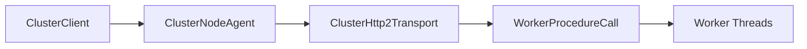
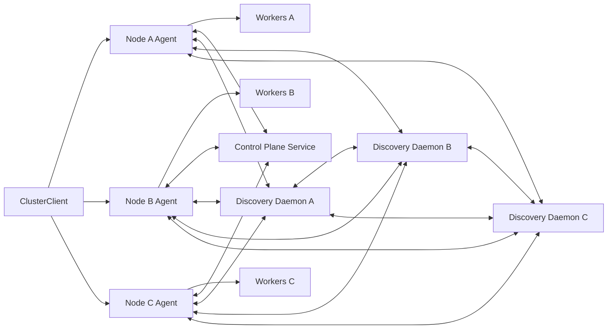
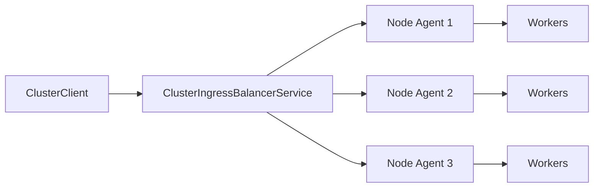
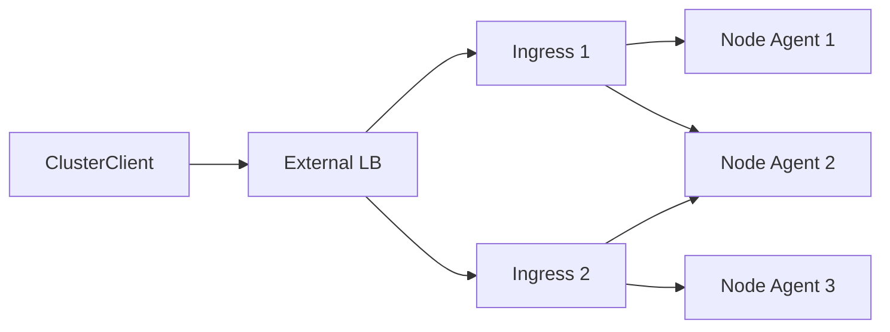
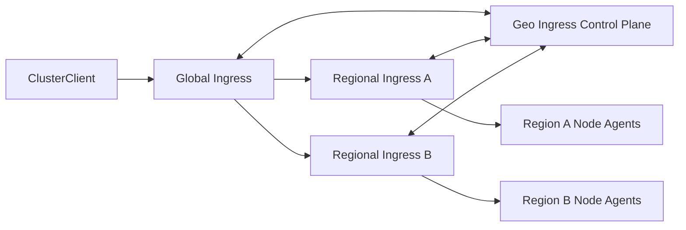
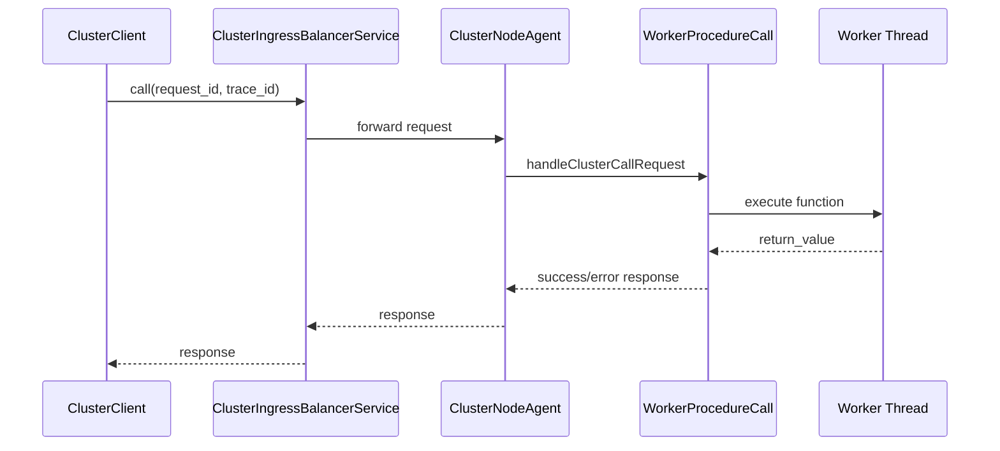

# Deployment Playbooks

## TL;DR
You can run a single node immediately, run multiple nodes with shared service discovery (including external daemon mode) for automatic registration/expiry, and use the built-in ingress balancer as the default front door.

> **Implemented Today**
> - Single-node deployment path.
> - Multi-node deployment by running multiple node agents.
> - Optional always-on control plane for multi-gateway topology/policy distribution.
> - Discovery-enabled node lifecycle (register/heartbeat/capability sync/expiry) with shared store or external daemon.
> - HA discovery deployment with multiple daemons (leader election + quorum writes).
> - Built-in ingress balancer in front of multiple gateways/nodes.
> - Global ingress orchestration via geo control plane for multi-region ingress pools.
> - Optional external LB in front of ingress instances.
> - Client SDK calls over network.
>
> **Not Yet**
> - Turnkey cross-region/federated discovery automation.

## Playbook A: Run One Node
1. Start one `WorkerProcedureCall` instance.
2. Start workers (`startWorkers`).
3. Define procedures/dependencies/constants as needed.
4. Start one `ClusterNodeAgent` + HTTP/2 transport.
5. Point `ClusterClient` to this node.

## Playbook B: Run Multiple Nodes
1. Repeat Playbook A on each server (`Node A`, `Node B`, `Node C`, ...).
2. Start `ClusterControlPlaneService` (single instance MVP) and configure each node agent with `control_plane.enabled=true` + endpoint.
3. Configure shared discovery:
   - in-process shared store for local scenarios, or
   - `ClusterServiceDiscoveryDaemon` for external shared discovery (single daemon or HA multi-daemon endpoint list).
4. Ensure each node publishes required functions/definitions.
5. Use policy/auth configuration consistently across nodes.
6. Decide ingress strategy:
   - direct client targeting per node,
   - built-in ingress service,
   - or external LB in front of ingress.

## Playbook C: Built-In Ingress Front Door
1. Deploy node agents on multiple hosts.
2. Start `ClusterIngressBalancerService` with control-plane/discovery/static target sources.
3. Point clients to ingress endpoint (`/wpc/cluster/ingress` by default).
4. Monitor ingress + transport + runtime metrics for balancing and failover behavior.

## Playbook D: External LB in Front of Ingress Cluster
1. Run multiple ingress instances.
2. Put external LB (L4/L7) in front of ingress endpoints.
3. Point clients to the external LB endpoint.
4. Keep ingress instances subscribed to control-plane/discovery sources.

## Playbook E: Multi-Region Global Ingress
1. Run one or more regional ingress instances per region.
2. Run `ClusterGeoIngressControlPlaneService`.
3. Configure regional ingress instances with `geo_ingress.enabled=true`, `role=regional`, and the geo control-plane endpoint.
4. Configure a global ingress instance with `geo_ingress.enabled=true`, `role=global`, and the same geo control-plane endpoint.
5. Point clients to the global ingress endpoint (or a global LB in front of global ingress replicas).
6. Tune:
   - `geo_ingress.stale_snapshot_max_age_ms`
   - `geo_ingress.max_cross_region_attempts`
   - routing mode in global policy.

## End-to-End Ingress Sequence (Built-In Ingress)

## Practical Notes
- Built-in ingress handles policy-aware request dispatch and bounded failover.
- External LB can still be useful for ingress instance HA and network-level controls.
- Runtime routing handles candidate-node choice inside a routing-enabled runtime context.
- Control plane distributes policy/topology versions to gateways and tracks gateway sync status.
- Discovery handles node registration/liveness/capability visibility when agents share the same backend.
- For very large fleets, run external daemon HA mode and plan cross-region federation separately.

## Assumptions (Explicit)
- If used, the external load balancer is managed outside this library.
- Shared discovery backend wiring/availability policy is configured by your application/operator layer.
