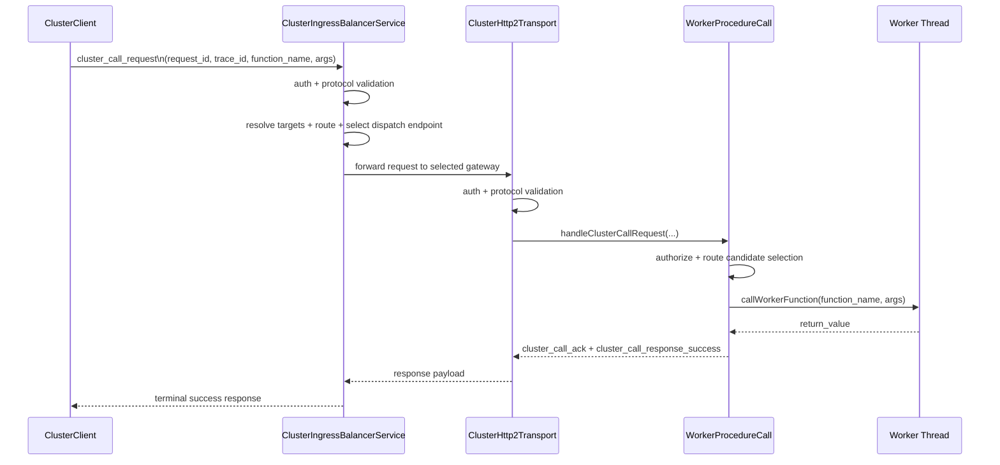
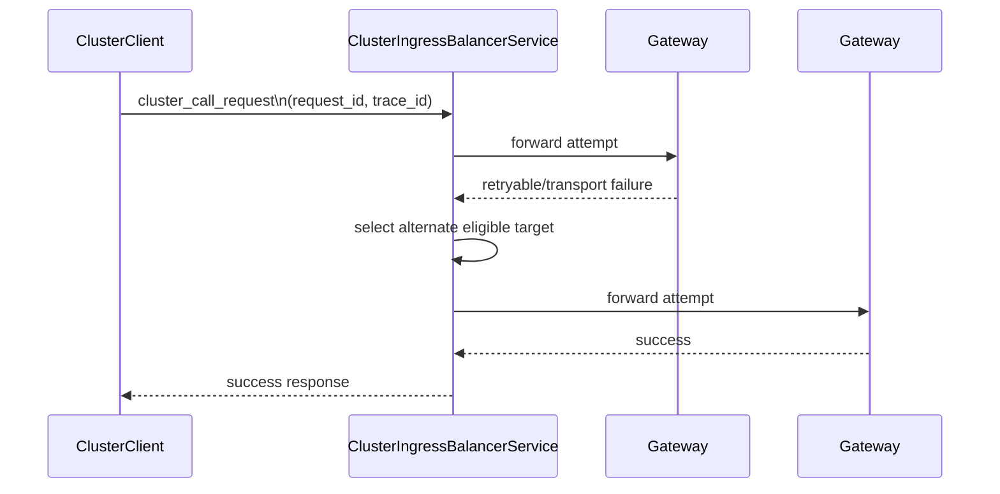
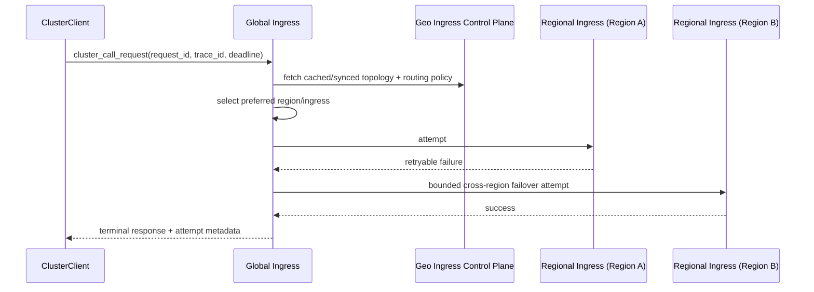
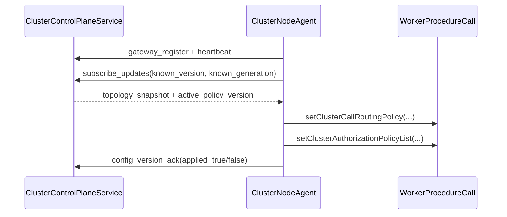

# End-to-End Call Flow

## TL;DR
A `ClusterClient.call(...)` request is serialized to protocol JSON, validated/authenticated at ingress, forwarded to a selected gateway/node, validated/routed by `WorkerProcedureCall`, executed on a worker thread (or routed node), and returned to the client.

> **Implemented Today**
> - Full call path from SDK to worker result.
> - Optional ingress front door path (`ClusterIngressBalancerService`) with deterministic dispatch.
> - Optional global ingress geo mode with region-aware selection and bounded cross-region failover.
> - Correlation identifiers (`request_id`, `trace_id`) are carried in protocol messages.
> - Retryable failures can trigger alternate-node dispatch.
> - Discovery-enabled runtimes can auto-sync candidate nodes from local or external discovery backends.
> - Control-plane-enabled gateways can continuously sync topology/policy versions and keep serving on last-known-good config during temporary control-plane outages.
>
> **Not Yet**
> - Global exactly-once semantics.
> - Multi-region globally coordinated call execution semantics.

## Success Path (Sequence)

## Retry / Failover Path (Sequence)

## Geo Global Ingress Path (Sequence)

## Step-by-Step Lifecycle
1. Client builds request message with deadline and routing hint.
2. Ingress validates/authenticates request and resolves eligible targets from control-plane/discovery/static snapshots.
3. Ingress routing chooses a target and forwards with preserved correlation/deadline metadata.
4. Transport validates message and authenticates identity.
5. Runtime authorizes function call and builds candidate node list (from local/discovery/control-plane topology depending on mode).
6. Runtime routing picks selected node (+ fallbacks).
7. Runtime executes locally or dispatches to registered remote executor.
8. Terminal success/error is returned and lifecycle telemetry is emitted at both ingress and runtime layers.

## Control-Plane Sync Influence

## Error + Retry Notes
- Retry behavior depends on error code + retryable flag.
- Unknown-outcome retry behavior requires idempotency awareness.
- Some errors are terminal (`AUTH_FAILED`, `FORBIDDEN_FUNCTION`, etc.).
- In geo mode, ingress retries within selected region first, then performs bounded cross-region attempts if policy allows.

## Correlation Guidance
Use `request_id` + `trace_id` as join keys across:
- transport events,
- runtime lifecycle events,
- client error handling logs.
