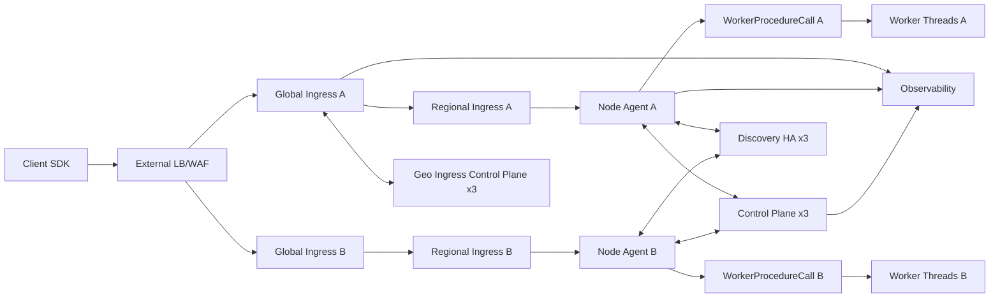
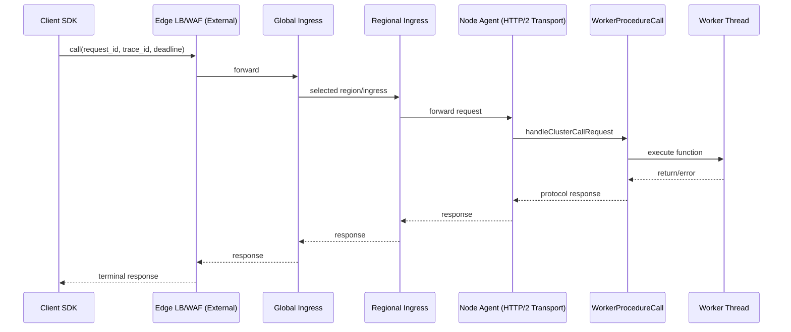
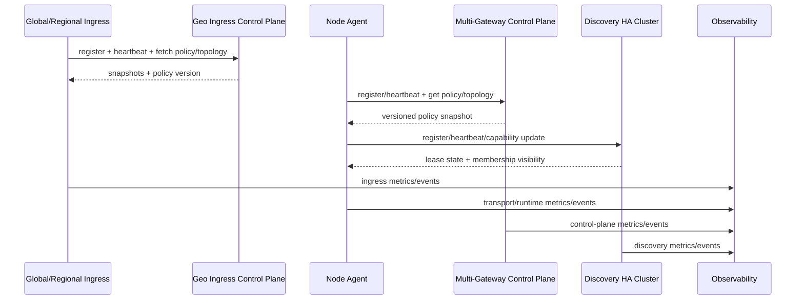

# Ideal Deployment Topology

## 1) TL;DR
An ideal production deployment uses separate server tiers for edge ingress, global ingress orchestration, regional ingress, node agents, control planes, discovery HA, and observability.  
Built-in components in this repo cover global/regional ingress logic, node execution, control-plane services, and discovery HA.  
External infrastructure still commonly provides internet edge (DNS/anycast/WAF/CDN/L4 LB) and org-wide security boundaries.

> **Implemented Today**
> - Built-in global/regional ingress services.
> - Geo ingress control plane.
> - Multi-gateway control plane.
> - HA discovery daemon cluster.
> - Node agent + worker execution runtime.
>
> **Operationally Recommended**
> - 3-node discovery HA quorum.
> - 3-node control-plane quorum.
> - 2+ ingress instances per region.
> - External LB or edge service in front of global ingress replicas.
>
> **Future/Optional Infrastructure**
> - Global anycast/edge network fabric (external).
> - CDN/WAF/geo DNS traffic steering (external).

## 2) Assumptions
- Regions: `us-east-1`, `us-west-1`, `eu-west-1`.
- Global ingress is deployed in at least 2 regions.
- Regional ingress pools forward to node-agent pools in the same region.
- `ClusterGeoIngressControlPlaneService` is reachable by global/regional ingress.
- `ClusterControlPlaneService` and HA discovery daemons are reachable by node agents.
- mTLS/token validation is enforced at ingress and transport boundaries.

## 3) Logical Capability-to-Server Mapping

| logical_capability | recommended_server_role | statefulness | HA pattern | scaling strategy | failure impact |
|---|---|---|---|---|---|
| client SDK callers | app client hosts | stateless | client retry + endpoint list | scale with app traffic | request retries increase |
| external edge ingress (optional) | managed edge/LB/WAF | stateless | provider HA | horizontal by traffic | public entry disruption |
| global ingress balancer | dedicated ingress servers | soft state (snapshots/metrics) | 2+ replicas + external LB | horizontal replicas | cross-region routing degraded |
| regional ingress balancer | per-region ingress servers | soft state | 2+ per region | horizontal per region | regional routing degraded |
| node agent transport | app compute servers | soft state + runtime refs | N per region | horizontal by workload | capacity and local failover loss |
| WorkerProcedureCall runtime | same host as node agent | in-memory runtime state | multi-node redundancy | scale with node count/cores | procedure capacity loss |
| worker thread pools | same host as runtime | ephemeral | per-host pool restart | tune per CPU | local latency/capacity impact |
| control plane service | dedicated control-plane servers | durable config/topology state | 3-node quorum recommended | read replicas + shard later | policy/topology convergence impact |
| geo ingress control plane | dedicated geo control servers | durable geo policy/topology | 3-node quorum recommended | scale reads, keep deterministic writes | global region selection staleness |
| discovery HA daemons | dedicated discovery servers | durable lease/membership state | 3-node quorum | horizontal read scale, bounded write quorum | node liveness visibility degraded |
| auth validation boundary | ingress/transport boundary servers | stateless + key cache | multi-instance + key rotation | horizontal by auth QPS | auth failures / blocked traffic |
| observability sink | metrics/log/event backend | durable | clustered backend | scale storage/ingest | reduced operator visibility |

## 4) Ideal Multi-Region Topology Diagram
```mermaid
flowchart TB
  subgraph Z1[Public Edge Trust Boundary]
    client[Client SDK Consumers]
    edge[External Edge LB / WAF / DNS / Anycast\n(External, Optional but Recommended)]
    client --> edge
  end

  subgraph Z2[Gateway Tier Trust Boundary]
    g1[Global Ingress Server A\nClusterIngressBalancerService]
    g2[Global Ingress Server B\nClusterIngressBalancerService]
    edge --> g1
    edge --> g2
  end

  subgraph Z3[Service Tier Trust Boundary]
    subgraph R1[Region us-east-1]
      ri1a[Regional Ingress A]
      ri1b[Regional Ingress B]
      na1a[Node Agent Server A]
      na1b[Node Agent Server B]
      wpc1a[WorkerProcedureCall Runtime A]
      wpc1b[WorkerProcedureCall Runtime B]
      wt1a[Worker Thread Pool A]
      wt1b[Worker Thread Pool B]
      ri1a --> na1a --> wpc1a --> wt1a
      ri1b --> na1b --> wpc1b --> wt1b
    end

    subgraph R2[Region us-west-1]
      ri2a[Regional Ingress A]
      ri2b[Regional Ingress B]
      na2a[Node Agent Server A]
      na2b[Node Agent Server B]
      wpc2a[WorkerProcedureCall Runtime A]
      wpc2b[WorkerProcedureCall Runtime B]
      wt2a[Worker Thread Pool A]
      wt2b[Worker Thread Pool B]
      ri2a --> na2a --> wpc2a --> wt2a
      ri2b --> na2b --> wpc2b --> wt2b
    end

    g1 --> ri1a
    g1 --> ri2a
    g2 --> ri1b
    g2 --> ri2b
  end

  subgraph Z4[Control-Plane Tier Trust Boundary]
    geo1[Geo Ingress Control Plane Node 1]
    geo2[Geo Ingress Control Plane Node 2]
    geo3[Geo Ingress Control Plane Node 3]
    cp1[Control Plane Node 1]
    cp2[Control Plane Node 2]
    cp3[Control Plane Node 3]
    d1[Discovery HA Daemon 1]
    d2[Discovery HA Daemon 2]
    d3[Discovery HA Daemon 3]
    geo1 <--> geo2
    geo2 <--> geo3
    geo3 <--> geo1
    cp1 <--> cp2
    cp2 <--> cp3
    cp3 <--> cp1
    d1 <--> d2
    d2 <--> d3
    d3 <--> d1
  end

  subgraph Z5[Data/Ops Tier Trust Boundary]
    auth[Auth Boundary\nmTLS + token validation + replay checks]
    obs[Observability Stack\nmetrics/logs/events/audit]
  end

  g1 --> auth
  g2 --> auth
  ri1a --> auth
  ri2a --> auth

  g1 <--> geo1
  g2 <--> geo2
  ri1a <--> geo1
  ri2a <--> geo2
  na1a <--> cp1
  na1b <--> cp2
  na2a <--> cp2
  na2b <--> cp3
  na1a <--> d1
  na1b <--> d2
  na2a <--> d2
  na2b <--> d3

  g1 --> obs
  g2 --> obs
  ri1a --> obs
  ri2a --> obs
  na1a --> obs
  na2a --> obs
  cp1 --> obs
  geo1 --> obs
  d1 --> obs
```

Why each tier exists:
- Public edge: internet-facing traffic protection, DDoS/WAF, global entry.
- Gateway tier: deterministic global request dispatch and failover.
- Service tier: procedure execution capacity close to business workloads.
- Control-plane tier: topology/policy/liveness truth and coordination.
- Data/ops tier: security authority and operator visibility.

## 5) Single-Region Simplified Topology Diagram


## 6) Traffic Flow (request path + control path)

### Request/Data Plane


### Control Path (sync + liveness)


## 7) Failure Domains and Failover Paths
- Global ingress instance failure: external edge shifts to surviving global ingress replicas.
- Regional ingress failure: global ingress retries same region or fails over cross-region (bounded by policy/deadline).
- Node agent/runtime failure: regional ingress retries alternative node targets.
- Discovery daemon minority failure: quorum survives; writes continue.
- Discovery quorum loss: no new quorum writes; routing uses last-known-good view until stale threshold behavior.
- Control-plane outage: gateways continue with last-known-good policy snapshot for bounded window (degraded mode).
- Geo control-plane outage: global ingress continues using cached snapshot for bounded window; then fails closed on stale threshold.

## 8) Minimum Viable Production Topology
Recommended minimum:
- 2 global ingress servers.
- 2 regional ingress servers per active region.
- 3 node-agent servers per region.
- 3 discovery HA daemon nodes.
- 3 control-plane nodes.
- 3 geo ingress control-plane nodes.
- 1 observability backend cluster (or managed service).
- 1 external edge entry service (LB/WAF) in front of global ingress.

Rationale:
- Tolerates single-instance failures in every critical tier.
- Keeps quorum-based control services resilient.
- Preserves bounded failover without unbounded fanout.

## 9) Scale-Up Topology (larger fleet)
For higher throughput/regions:
- Increase regional ingress replicas first (front-door pressure).
- Increase node-agent servers next (execution capacity).
- Increase worker counts per node only after CPU/memory profiling.
- Keep control/discovery/geo planes at odd quorum counts (`3` then `5`).
- Add more global ingress replicas and keep external edge fanout broad.
- Shard tenants/environments by regional ingress pools when needed.

## 10) Implemented Today vs External Infrastructure Responsibilities

Implemented in this library:
- Global/regional ingress services and geo orchestration logic.
- Node transport + runtime execution.
- Control-plane and discovery coordination services (including HA discovery).
- Auth checks, routing decisions, retries/failover semantics, telemetry APIs.

Typically external to this library:
- Internet edge anycast/DNS/WAF/CDN.
- Public certificate lifecycle and enterprise PKI operations.
- Centralized metrics/log storage platform.
- Organization-specific deployment automation and secrets management.

## 11) Operator Notes (security, observability, upgrades)
- Security:
  - Enforce mTLS + token validation at ingress and transport boundaries.
  - Keep replay protection enabled for privileged/admin paths.
  - Use least-privilege policy scopes by tenant/environment.
- Observability:
  - Monitor ingress no-target/failover spikes.
  - Monitor control/discovery quorum health and sync lag.
  - Correlate by `trace_id`, `request_id`, and `mutation_id`.
- Upgrades:
  - Roll ingress and node agents gradually by region.
  - Keep control/discovery quorums healthy during rolling restarts.
  - Verify policy/version convergence before shifting full traffic.
