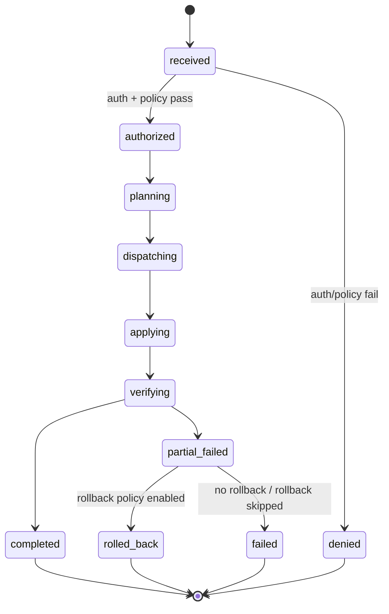

# Mutation Plane Overview

## TL;DR
The admin mutation plane lets authorized clients change runtime definitions while the system is running: define/redefine/undefine functions, dependencies, constants, and database connections.

> **Implemented Today**
> - Network mutation requests -> runtime mutation handling.
> - Dry-run support.
> - Rollout modes and rollback policies.
> - Authz checks separate from normal call execution.
> - Audit records + mutation metrics/events.
>
> **Not Yet**
> - Fully automatic global orchestration fabric independent of your deployment topology.

## What Can Be Mutated
- Functions: define/redefine/undefine
- Dependencies: define/undefine
- Constants: define/undefine
- Database connections: define/undefine
- Shared-memory admin mutations (where configured)

## Security Boundary
Mutation permission is separate from call permission:
- `rpc.call:*` does not imply mutation rights.
- mutation requests must satisfy mutation-plane auth and policy checks.

## Lifecycle State Machine

## Dry Run and Rollout
- Dry run validates and plans without mutating state.
- Rollout strategy controls how changes propagate (`single_node`, `all_at_once`, `rolling_percent`, `canary_then_expand`).
- Rollback policy can trigger rollback on partial/verification failures.

## Operational Signals
- Mutation metrics: request/success/failure/rollback/authz-denied counters.
- Lifecycle events: requested/authorized/applied/partially_failed/rolled_back/denied.
- Immutable audit records for mutation history and outcomes.
