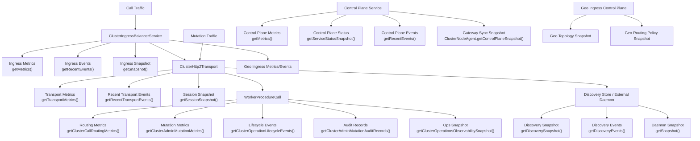

# Operations and Observability

## TL;DR
You now have runtime snapshots, lifecycle event streams, transport metrics, mutation audits, and chaos tests. Operators can monitor call health, mutation safety, auth anomalies, and degradation patterns.

> **Implemented Today**
> - Ingress metrics/events/snapshots (`ClusterIngressBalancerService.getMetrics/getRecentEvents/getSnapshot`).
> - Geo ingress metrics/events for global region selection/failover/degraded-staleness behavior.
> - Runtime lifecycle events (`getClusterOperationLifecycleEvents`).
> - Runtime observability snapshot (`getClusterOperationsObservabilitySnapshot`).
> - Routing and mutation metrics APIs.
> - Transport metrics/events (`getTransportMetrics`, `getRecentTransportEvents`, `getSessionSnapshot`).
> - Discovery snapshots/events (`getDiscoverySnapshot`, `getDiscoveryEvents`, discovery store metrics).
> - External discovery daemon telemetry (`ClusterServiceDiscoveryDaemon.getSnapshot/getMetrics/getRecentEvents`).
> - Control-plane telemetry (`ClusterControlPlaneService.getMetrics/getServiceStatusSnapshot/getRecentEvents`) and gateway sync status (`ClusterNodeAgent.getControlPlaneSnapshot`).
> - Chaos/stress tests for major failure classes.
>
> **Not Yet**
> - Built-in dashboard product.
> - Built-in alert delivery system (PagerDuty/Slack/etc.)

## Telemetry Sources
- Runtime (`WorkerProcedureCall`)
  - call routing metrics
  - mutation metrics
  - mutation audit records
  - operation lifecycle events
- Transport (`ClusterNodeAgent` / `ClusterHttp2Transport`)
  - session connect/disconnect/auth
  - request completed/failed/cancelled
  - auth/replay-related failures
- Discovery (`ClusterNodeAgent` / discovery store)
  - registered/active/expired node counts
  - heartbeat lag and expiry counters
  - recent discovery lifecycle events
- Discovery daemon (`ClusterServiceDiscoveryDaemon`)
  - request success/failure counts
  - validation/auth/state/internal failure breakdown
  - daemon event history with `request_id`/`trace_id`
- Ingress (`ClusterIngressBalancerService`)
  - request/success/failure/retry/failover counts
  - target selection reasons and per-target dispatch statistics
  - target snapshot staleness indicators
- Geo ingress (`ClusterIngressBalancerService` + `ClusterGeoIngressControlPlaneService`)
  - `geo_ingress_requests_total`, `geo_ingress_success_total`, `geo_ingress_failure_total`
  - `geo_ingress_region_failover_total`
  - `geo_ingress_region_selection_count_by_reason`
  - `geo_ingress_control_stale_total`
  - `geo_ingress_dispatch_latency_ms`
  - geo lifecycle events (`geo_ingress_region_selected`, `geo_ingress_failover_attempted`, `geo_ingress_region_degraded`, `geo_ingress_region_restored`)
  - topology/policy snapshots from geo control-plane
- Control plane (`ClusterControlPlaneService` + `ClusterNodeAgent`)
  - gateway register/active counts
  - policy version publish/apply failures
  - control-plane sync lag and degraded/stale mode visibility
  - control-plane request failure counts by reason

## Alert Categories (Recommended)
- Mutation failure spikes.
- Authorization denial anomalies.
- Ingress no-target/failover spikes.
- Timeout/retry storms.
- Rollback frequency increase.
- Node health degradation and unhealthy filtering growth.

## Operator Mental Model
1. Is failure at transport/auth, routing/dispatch, worker execution, or mutation policy?
2. Use `request_id`/`trace_id`/`mutation_id` to correlate events.
3. Confirm deterministic terminal outcome.
4. Apply runbook action (drain/rollback/rotate/restrict).

## Related Operational Docs
- `design_documentation/Operations_Runbook_Phase13.md`
- `design_documentation/Operations_Readiness_Checklist_Phase13.md`
