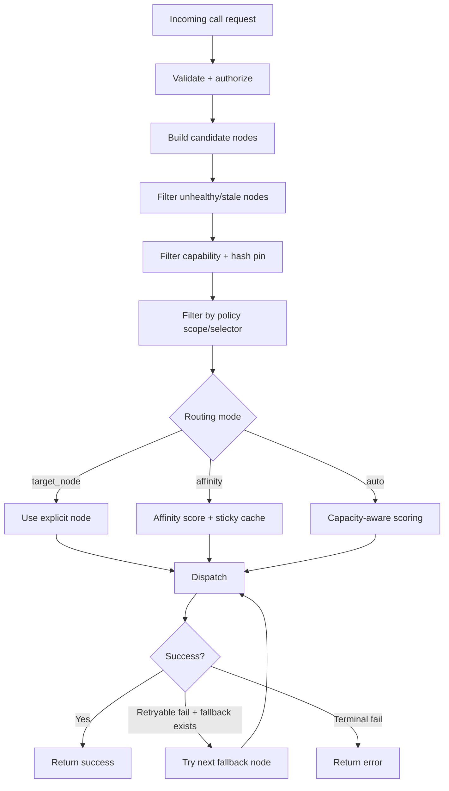

# Routing and Balancing

## TL;DR
Routing is implemented at two layers:
- ingress layer (`ClusterIngressBalancerService`) for front-door target dispatch,
- runtime layer (`WorkerProcedureCall`) for node-level routing.
Both layers filter by health/capability/policy and can fail over on retryable failures.

> **Implemented Today**
> - Ingress routing modes (`least_loaded`, `weighted_rr`, `affinity`, `target_node` when hinted).
> - Ingress target resolution from control-plane/discovery/static snapshots.
> - Optional global geo ingress routing from geo control-plane snapshots.
> - Ingress bounded retry/failover with deadline-aware behavior.
> - Capacity-aware selection (`auto`).
> - Sticky affinity (`affinity`).
> - Explicit pinning (`target_node`).
> - Health/capability/authorization filtering.
> - Retry/failover to alternate nodes when safe.
> - Discovery-backed dynamic node candidate sync when enabled.
>
> **Not Yet**
> - Built-in anycast/edge network fabric (BGP/POP-level ingress).

## Routing Modes
- `auto`: weighted least-loaded style selection (inflight + latency + error penalties).
- `affinity`: sticky-ish routing keyed by `affinity_key` with TTL.
- `target_node`: direct pinning to one node ID.

## Ingress Routing Modes
- `least_loaded`: lowest pending/inflight pressure first with deterministic tie-break.
- `weighted_rr`: weighted round robin adjusted by observed target health.
- `affinity`: sticky selection by request affinity key or caller identity.
- `target_node` hint: explicit node pinning if policy and availability allow it.

## Global Geo Routing Modes
- `latency_aware`: prefers lower-latency healthy regions, then deterministic tie-break.
- `capacity_aware`: prefers higher-capacity/lower-load regions.
- `affinity`: deterministic region stickiness by affinity key/subject.
- `target_region_id` hint: explicit region pinning when policy allows.
- Cross-region failover is bounded by `geo_ingress.max_cross_region_attempts` and request deadline.

## Decision Path

## Health/Capability/Failover
- Health: stale/unhealthy nodes are filtered.
- Capability: node must support requested function (and optional hash pin).
- Authorization scope: candidate nodes can be removed by policy constraints.
- Failover: retryable dispatch errors can shift to fallback nodes.

## Single Node vs Multi Node
| Area | Single Node | Multi Node |
|---|---|---|
| Ingress | Client -> one node or ingress | Client -> ingress -> many nodes (optional external LB in front of ingress) |
| Balancing | Worker thread scheduling only | Worker thread scheduling + node routing |
| Failure handling | local worker restarts/timeouts | local handling + optional node failover |
| Discovery | not needed | built-in store interface + heartbeats/leases (local or external daemon) |
| Shared memory | local process only | local per node only |

## Built-In Balancer Boundary
- Built in: ingress dispatch + runtime node-selection once nodes are known/registered.
- External still useful: edge traffic steering, cross-region anycast, enterprise WAF/CDN fronting.
