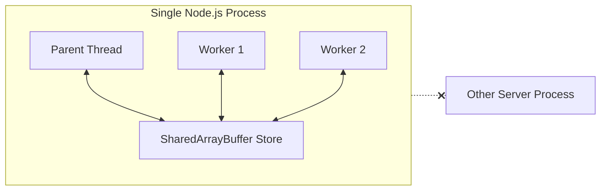
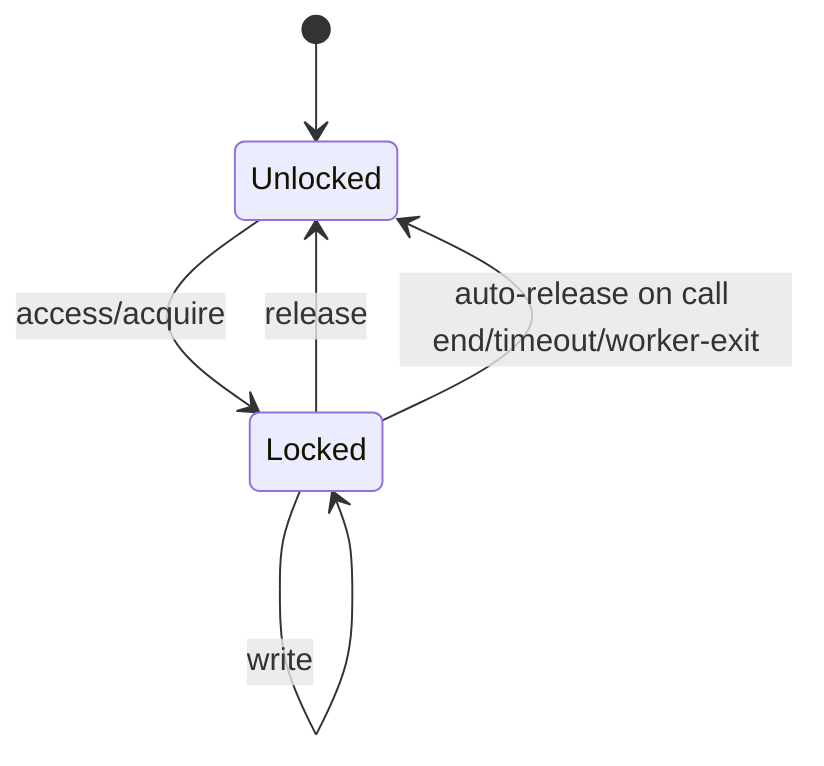

# Shared Memory Scope

## TL;DR
Shared memory features are fast and lock-aware, but scoped to a single Node.js process. They are not distributed shared memory across cluster nodes.

> **Implemented Today**
> - Chunk create/access/write/release/free APIs.
> - Lock ownership and auto-release safeguards at call boundaries.
> - Lock debug visibility and contention diagnostics.
>
> **Not Yet**
> - Cross-node shared-memory heap semantics.
> - Global distributed lock manager using this same in-process memory model.

## What It Is Good For
- Fast local coordination between worker threads in one runtime.
- Lock-aware local shared state where IPC payload overhead is expensive.

## What It Is Not
- Not a cluster-wide key-value store.
- Not shared across servers over network.

## Local Scope Diagram

## Lock Lifecycle (Mini Diagram)

## Practical Rule of Thumb
If multiple machines must see the same value, use a networked datastore.
If multiple workers in one process need fast shared state, shared memory is appropriate.
