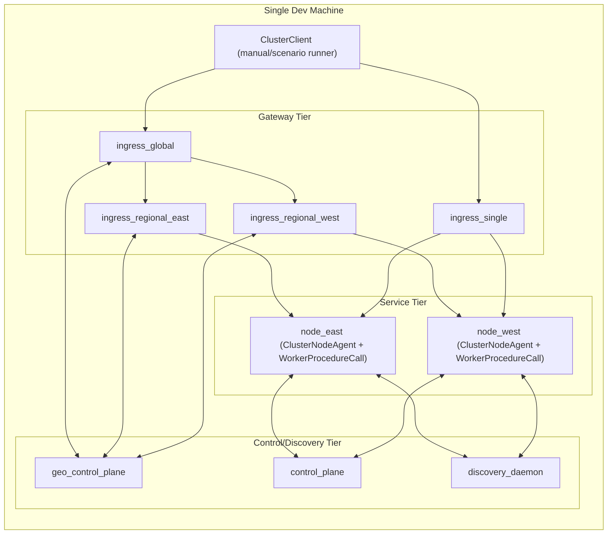

# Local Cluster Lab Diagram

```mermaid
flowchart LR
  subgraph LocalMachine["Single Dev Machine"]
    client["ClusterClient (manual/scenario runner)"]

    subgraph GatewayTier["Gateway Tier"]
      ingressGlobal["ingress_global"]
      ingressRegionalEast["ingress_regional_east"]
      ingressRegionalWest["ingress_regional_west"]
      ingressSingle["ingress_single"]
    end

    subgraph ServiceTier["Service Tier"]
      nodeEast["node_east (ClusterNodeAgent + WorkerProcedureCall)"]
      nodeWest["node_west (ClusterNodeAgent + WorkerProcedureCall)"]
    end

    subgraph ControlTier["Control/Discovery Tier"]
      geoCP["geo_control_plane"]
      cp["control_plane"]
      discovery["discovery_daemon"]
    end

    client --> ingressGlobal
    client --> ingressSingle
    ingressGlobal --> ingressRegionalEast --> nodeEast
    ingressGlobal --> ingressRegionalWest --> nodeWest
    ingressSingle --> nodeEast
    ingressSingle --> nodeWest

    ingressGlobal <--> geoCP
    ingressRegionalEast <--> geoCP
    ingressRegionalWest <--> geoCP

    nodeEast <--> cp
    nodeWest <--> cp
    nodeEast <--> discovery
    nodeWest <--> discovery
  end
```

